# 前言

# Start here: 入口级网站和应用 {#necessary_resources}

::: flushright
------据说99%的博士生都收藏了这些
:::

## 网站

-   西浦校内网站导航：<https://guide.xjtlu.edu.cn>

-   个人信息门户ebridge：<https://ebridge.xjtlu.edu.cn>

-   利物浦信息门户Liverpool
    Life：<https://liverpool-life.liverpool.ac.uk>

## 公众号

+:----------------------------------------------------------:+:-:+:-:+
| {width="\\linewidth"} |   |   |
|                                                            |   |   |
| {width="\\linewidth"} |   |   |
|                                                            |   |   |
| {width="\\linewidth"} |   |   |
|                                                            |   |   |
| {width="\\linewidth"} |   |   |
+------------------------------------------------------------+---+---+

: IT

另外，各学院可能有公众号，可在微信搜 "西浦 学院名\"
\"西交利物浦 学院名\"

## 手机APP

<https://guide.xjtlu.edu.cn/How-to-install-the-XJTLU-APP.html>

## 常用资源位置

-   西浦PGR Handbook电子版、学校政策、校规：登录ebridge，在中间的PGR
    Policies, Procedures and Forms里

-   利物浦PGR Handbook电子版
    <https://www.liverpool.ac.uk/student-administration/research-students/pgr-handbook/>

-   校园地图：见附录 Chapter.[9](#sec.appendix){reference-type="ref"
    reference="sec.appendix"}。或者微信搜"西浦地图"小程序

-   校历：ebridge登录后左边 Academic Calendar

-   常用电话：见附录 Chapter.[9](#sec.appendix){reference-type="ref"
    reference="sec.appendix"}

# 这些必须得做，不然毕不了业 {#must-do}

## 必修课程

学校为博士生提供了一系列的课程，会在learning
mall的页面公布（[链接在此](https://core.xjtlu.edu.cn/course/view.php?id=847)），也会以*Updates
on Workshops for Postgraduate Research
Students*为题的邮件通知大家。绝大部分的课程大家依照自己的水平选择参加，但是，其中有两门是必须要参加的，否则没法毕业。分别是

-   Supervisor-Supervisee Relationships

-   Research Integrity (Ethics)

这两个workshop，每个**学期**都有，但在毕业之前务必参加分别一次，以参加时扫码签到情况为准。

::: flushright
(2022年10月07日 by )
:::

## Liverpool Life 会议记录 {#sec.meeting_record}

作为APR要求的一部分，每位同学作为利物浦的博士生，必须要在一个称作Liverpool-life的系统里，记录自己和导师的会议时间和内容。下面为大家演示一下如何操作。

1.  首先进入liverpool-life网站<https://liverpool-life.liverpool.ac.uk/>，用你的利物浦学号（不是邮箱，更不是西浦学号）和密码登录

2.  找到PGR Record of Supervisory Meetings，点击View all meetings

3.  点击Arange new
    meeting，会弹出窗口，填入日期时间，选择导师（在你后面全部填写完过后，被选中的导师会在他的利物浦邮箱收到邮件）。取消勾选第一个create
    calendar
    appointment，否则会在利物浦邮箱的日历里创建一个多半用不上的日程（因为西浦的学生一般都用西浦邮箱对应的日历系统，利物浦的日历系统应该是从来不用的），然后勾选下面的has
    been pre-agreed。

    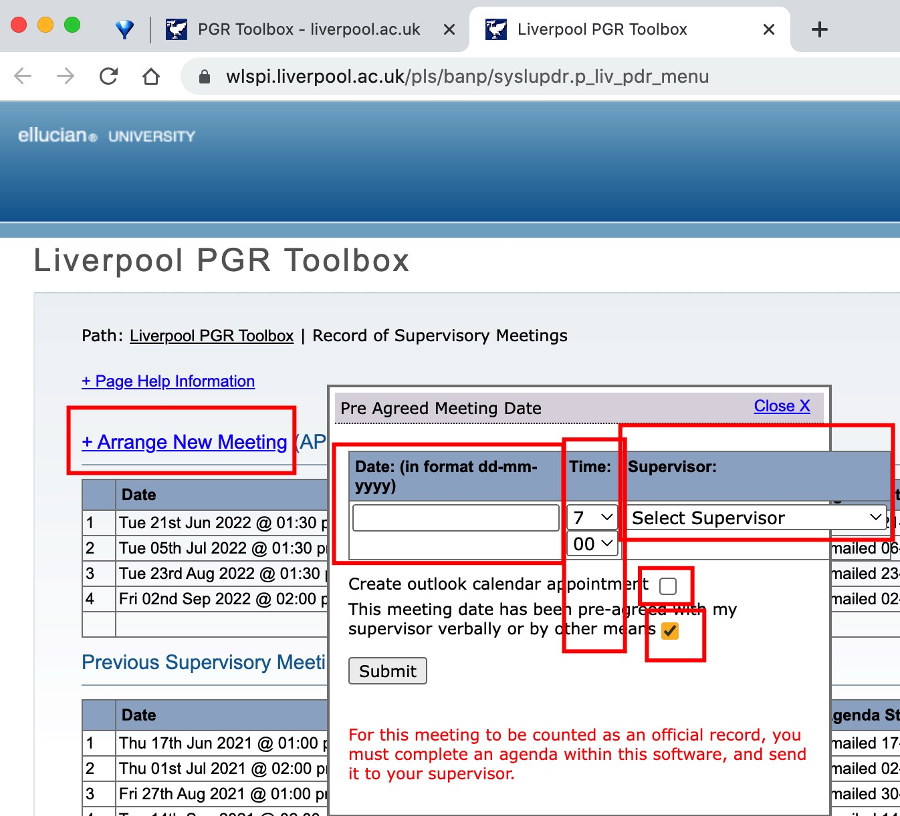{width="0.5\\columnwidth"}

4.  然后回忆一下你最近一次跟导师meeting时谈论的内容，填写进度报告（你做了什么）、target（直到下次meeting前打算做什么）、讨论项目

    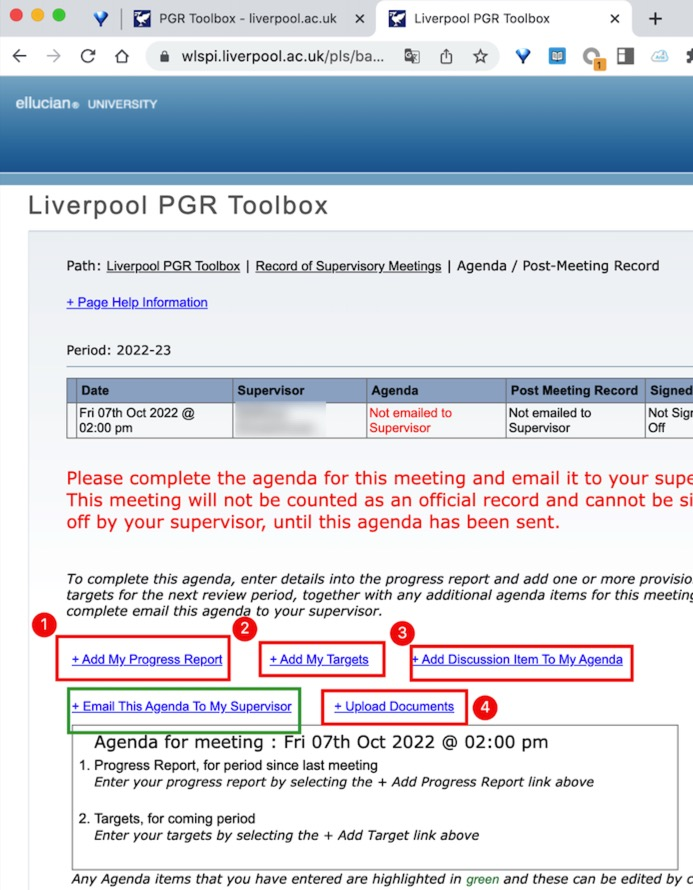{width="0.5\\columnwidth"}

5.  内容不用太多，但也不能太敷衍，毕竟利物浦是要检查的。填完过后，点击email
    this
    agenda，然后你和你导师的利物浦邮箱都会收到一封系统自动生成的邮件。

    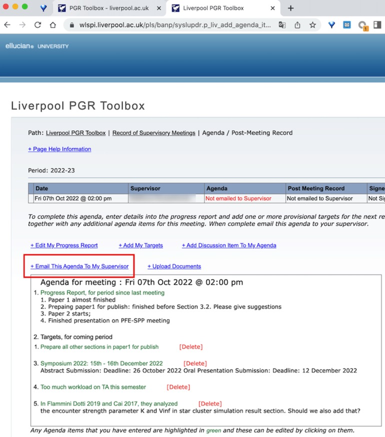{width="0.5\\columnwidth"}

6.  到这里不要着急关闭，还要填一下你们会议中的意见。点击右边的view edit
    meeting

    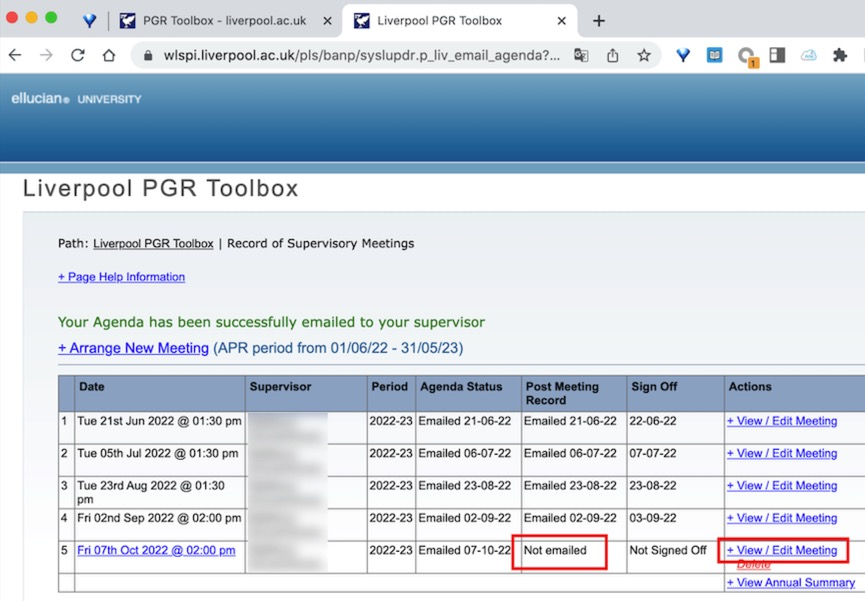{width="0.5\\columnwidth"}

7.  填入会议中的意见。最后点左上角email，你和导师的利物浦邮箱又会收到一封邮件

    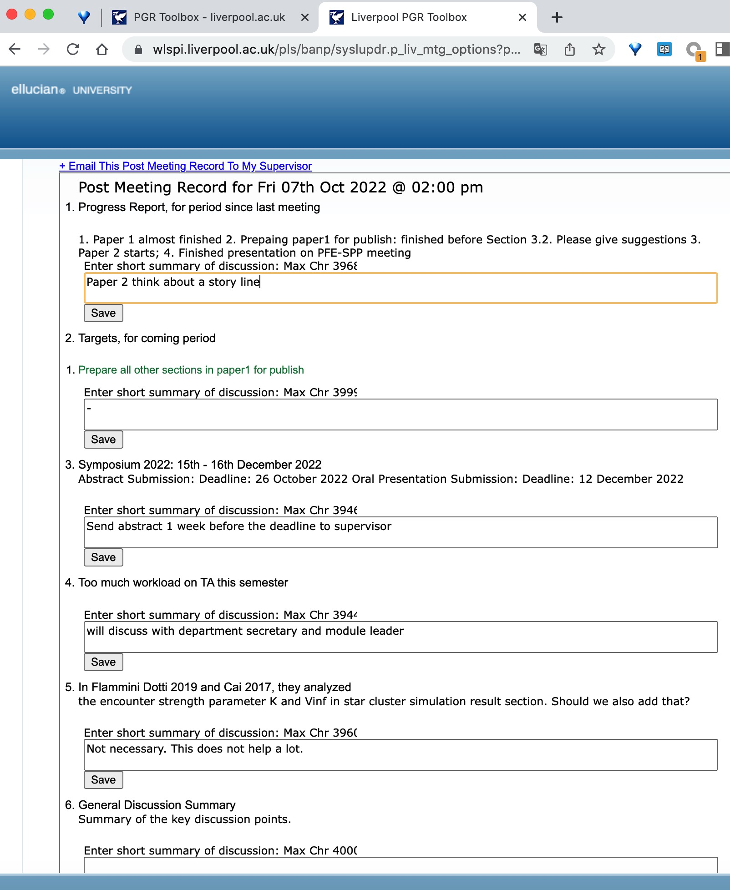{width="0.5\\columnwidth"}

8.  到这里你要做的就结束了。你导师需要在他利物浦邮箱收到的邮件里，点击sign
    off，之后你的利物浦邮箱会收到一封题为 *PGR Supervisor Meeting 5 (Fri
    07th Oct 2022 @ 02:00 pm): sign off comments*
    的邮件，然后这次meeting
    record才算全部完成。每年APR之前，必须要每月至少1次的meeting全部sign
    off。如果你的导师一直没sign off，需要提醒他

【几个注意事项】

-   这个记录最好是每个月填一次。虽然可以补，就是几个月不填然后一口气补半年的，这样是被允许的，但是不规范。我个人的经验里，如果放到APR前夕来补，一来也忘了当年的进度到底是什么，二来APR前夕也很忙。所以，尽量还是按要求每月填一次吧

-   liverpool
    life和这个填报网站，经！常！登！不！上！去！因为各种网络和系统的问题，反正即使在西浦校内用wifi和网线都是概率登得上去。据各位同学亲测，一般自己使用科学上网，开全局代理，连通性会好很多，但这些不太合法的方法不能教给大家，也万万不能在微信、QQ里讨论，否则会封号、炸群。不会科学上网的同学，更是要尽量早填报，否则到deadline登不上去就更着急。

::: flushright
(2022年10月10日 by )
:::

## APR

### APR 是什么

首先请看官方说明。没看过的同学，请务必逐字逐句阅读完毕，因为APR重要性相当于一次小答辩。不通过的，会被退学。

<https://www.liverpool.ac.uk/student-administration/research-students/progression/annual-progress/>

在我的理解里，APR的作用是

-   Interview:
    读PhD本身很不容易，所以学校、学院需要了解学生遇到的问题，帮助解决

-   Seminar: 锻炼作报告的能力 + 认识其他博士生同学

-   Progress report:
    检查学生进度，进一步发现并帮助解决学生遇到的问题。同时，筛查完全不认真学习的学生

有同学一开始面对APR的时候会很紧张。实际上，进度报告部分，只要不是一整年真的天天混日子，看书、读文献、写文章、做调查、做实验、写代码等等任何一样都没干，评审老师是不会刁难你不给过的。听说22年某学院APR有个学生不通过，据可靠消息此人是近乎人间蒸发，导师消息完全不回，工作不做，才fail的。

而且要注意到，APR的另一个主要功能是------帮助大家解决问题。所以，反而应该大胆的在APR里暴露自己的问题，寻求帮助
(Chapter. [3.3.2.5](#sec.IPAP){reference-type="ref"
reference="sec.IPAP"})。

### APR 流程

#### 准备工作

APR的前置任务只有一个，那就是要填完**每月至少一次**的会议记录。关于如何填写会议记录，参见章节
[3.2](#sec.meeting_record){reference-type="ref"
reference="sec.meeting_record"}。

然后，每年关于APR有两封重要邮件

1.  其一为西浦在5月发的邮件，大概长这样，发到西浦邮箱

    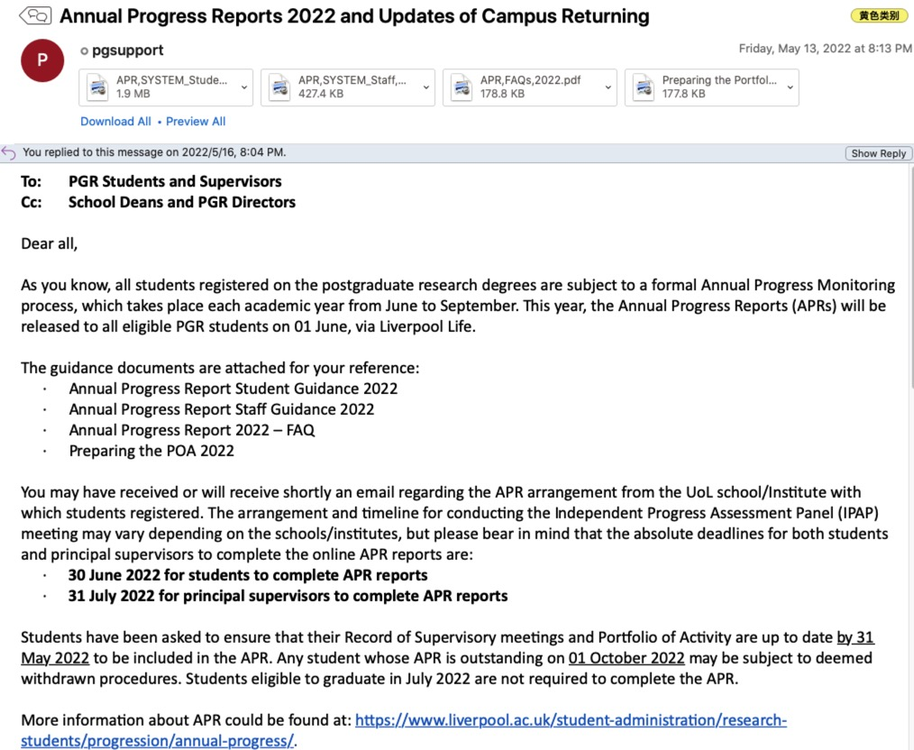{width="0.95\\columnwidth"}

2.  其二为你的利物浦学院在4月到5月发的邮件，数学学院的大概长这样，发到利物浦邮箱。其他学院的可能不太一样。各个学院发通知的时间也有很大不同，有4月就发的，有拖到5月底的。

    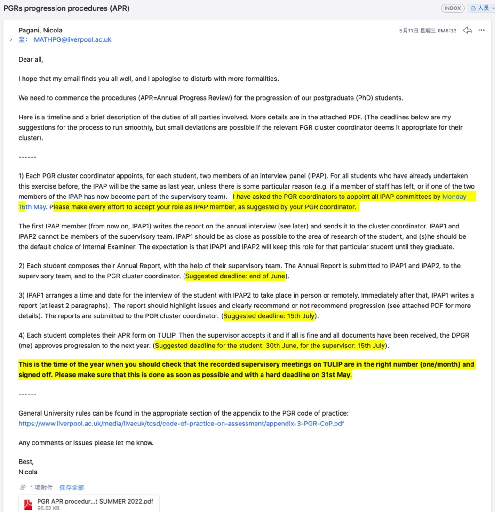{width="0.95\\columnwidth"}

每个学院的APR要求略有区别，所以在5月左右，请务必查收你的利物浦邮箱。两封邮件，请务必仔细阅读。**初次做APR的同学，建议对两封邮件和附件，逐字阅读。**

APR的具体内容就是下面四个部分

#### TULIP 网页表格

利物浦和西浦邮件里所谓的 "Your annual progress report has been
released\" 就是说这个绿油油的表你可以填了。里面主要是这几部分要填：

1.  SUMMARY OF PROGRESS 进度报告，300词以上，4000字符（约600词）以下

2.  Seminars and Conference attendance, Library and IT training and all
    subject specific training including research methods and
    experimental techniques.
    （回忆一下，越多越好，实在没有也没关系）参加的会议、研讨会、专业技能培训

3.  Attendance at careers events and workshops covering Employability
    and Entrepreneurship and including attendance at any other
    Professional development workshops. （越多越好）参加的就业相关活动

4.  Training and completion of activities relating to Health and Safety,
    ethics, grant writing and similar activities, including Project
    Management. （越多越好）参加的和学习不直接相关但又有关的活动

5.  Details of your Presentations, written publications, teaching and
    public engagement/Impact activities and related training in for
    these activities. （越多越好）参加的展示、发表的论文、做过的助教

6.  PERSONAL OR ACADEMIC PROBLEMS: Have there been any problems in the
    last year which you feel have affected your progress?
    （按实际情况填写）有没有遇到什么阻碍学习的问题。直白点说，可以真切的提出问题，也可适当甩锅，就是"我进度不够都是因为xxxxxx（生病了/结婚了/学校网络不行/自己英语阅读太慢/自己某方面能力欠缺）"

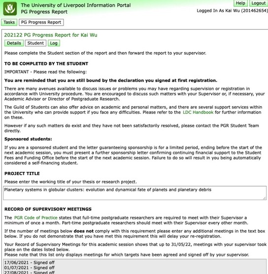{width="0.7\\columnwidth"}

TULIP表不分学院，所有同学都肯定要填。但以下 ↓
三个部分**各个学院要求可能非常不同，同时还部分取决于你隶属的利物浦学院**，可能跟你的学长学姐double
check。

#### Annual Report (AR) 年度报告

简单来说，把你做了什么**写成一篇文档**。一般会有字数或者页数要求。如果你真的不知道写什么，我个人建议可以事无巨细的写，按时间顺序~~（写成流水账）~~，比如，读了什么文献，有了什么收获；写了什么代码/做了什么实验。以及很重要的，参加了什么学术活动，比如参加conference,
meeting，还有做学校的TA，都可以写进去。换而言之，就是把上面的TULIP表格的内容用文档再说一遍，基本就是复制粘贴，然后字数不够的话扩充一下内容。

当然，有特殊要求的按要求做，比如数学学院对 Year 3 要求交 Thesis Outline
毕业论文大纲就可以，那就不用写流水账了。

请注意，这部分AR的描述是以我所在的数理学院为例。听其他学院同学说，很多学院要求是类似的，但也有学院要求超级多。据某化学专业同学，他们第一年要写30-50页文献综述，这种就必须提前一两个月开始准备。**新同学请务必咨询你的学长学姐或者导师。**

#### Annual Seminar 年度研讨会

一般是把一个学院或者一个系的所有PhD拉到一起做个展示，互相提提意见，了解下。但据我所知，有的人少的系直接跳过了这一部分，或者把这一部分融合到下面的面试里，变成给两位老师讲。不管是什么形式，你需要**做一个PPT**，让别人了解你的研究。时长可以按20分钟展示+5分钟提问准备，有些学院要求可能不一样，问学长学姐。如果你工作成果多，可以挑重点展示；如果不多的话，流水账一样展示自己做了什么，撑起来时长，让老师觉得你做了很多工作就行。

#### IPAP Interview 面试 {#sec.IPAP}

学院会找两位不是你的导师且和你没有利益冲突的老师来和你面谈。你可能需要**做一个PPT**，在里面放心大胆写下你遇到的问题。以下问题都可以和IPAP老师谈。按照要求，两位老师会竭尽所能帮你解决问题

-   设备问题：学校电脑故障，比如哪里用起来不顺手，卡顿，死机；办公室环境问题（例如空调对着头吹）

-   实实在在的科研问题：你文献读得太少，但又不知道怎么高效读；你不知道实验方法；你写作有很大困难；你因为非主观的原因无法参加很多学术会议（比如这几年，每年APR我们都要吐槽疫情的各种影响）等等

-   导师问题：你导师压榨你，每天让你996工作，让你疲惫不堪；你导师让你做很多无关工作，比如给他搬家，给他拿外卖，给他报销；你导师对你很凶，对你很push，让你每天精神高度紧张；你导师频繁在非工作时间打电话、发微信、邮件并要求你立即回复，让你无法休息；你导师抢你论文一作；你导师长期失联，动不动就三五天不回你邮件。这些问题，其实都是导师的严重失职。一旦遇到，都可能造成很严重的心理负担，并影响后面的工作效率。IPAP就是来做这个的，请务必和面试的老师聊清楚。

-   情绪、心理问题：焦虑、紧张、失眠、抑郁倾向（注：如果觉得自己状态不好，请务必尽早联系学校心理咨询室
    ，免费）

-   家庭压力：你家里要求你3年毕业，但是你觉得压力太大

-   经济压力，身体问题（哪里严重不舒服，可能需要休学/请假休养），等等任何影响你正常PhD工作的问题

定位并解决所有问题，然后开启下一学年的学习，就是APR的主要目的。如果有任何APR不方便/无法解决的问题，请及时与导师、系主任、院长、你的DA、学校心理咨询室沟通。同时，请参阅本手册第
[6.8](#sec.mental_health){reference-type="ref"
reference="sec.mental_health"} 章「重视自己的负面情绪和抑郁倾向」。

::: flushright
(2022年10月12日 by )
:::

## Research Symposium

### XPGRS是什么

XJTLU Postgraduate Research
Symposium，简称XPGRS，或者Symposium，官方中文名是"博士生论坛"，是研究生院组织的活动。每年12月，会让全校的博士生一起用poster或者oral
presentation展示自己的研究成果或者进展。每年的XPGRS，会在国庆节前后用邮件通知大家。

### 我需要参加哪一项？

官方要求是这样的：

-   二年级的博士生需要做海报演讲

-   三年级的博士生需要做口头报告

-   四年级或以上的博士生将被邀请担任会议主席

-   也欢迎处于毕业论文阶段的硕士生参加

结合往年的实际情况，翻译过来就是：

-   一年级的没事，但可以考虑做志愿者（会发邮件招募），或者直接去现场围观，了解前辈的工作

-   二年级的，必须做poster

-   三年级的，必须做oral presentation，可以考虑做chair

-   四年或以上就随便了

判断自己是哪一年级的，以当年12月1日为准。这对3-9月入学的不难，但有很多同学就恰好是在12月1日入学的。据22年的消息，这部分同学是需要做的，也就是比如21年12月入学，22年需要做poster。
当然，由于12月入学同学确实特殊，政策可能会变，因此最好每年发邮件（或者打电话）问研究生院。

理论上，其实每年你都可以同时参加poster和oral，只要你愿意！甚至，也可以从来都不去！但需要导师同意。一般没有特殊原因，导师也是希望你去锻炼下的。如果实在有原因，需要导师和研究生院联系，同意了就可以不去。（我听说过有的导师觉得symposium没卵用直接让学生从来都不参加，也有的导师，第一次就让学生同时做poster+oral\...）

{width="\\columnwidth"}

### 有什么用

1.  锻炼作报告的能力，锻炼英语口语，获得校内其他老师的指导

2.  可以得奖。学校会请几位老师来听你讲海报、讲PPT，并给你打分。会选出最佳海报奖（10%）最佳演讲奖（10%）优秀海报奖（20%）优秀演讲奖（20%），会有一张奖状，外加1000和500元的......会议经费（会议经费使用参见章节[4.1](#sec.fund){reference-type="ref"
    reference="sec.fund"}），虽然不是现金奖励，但还算有用吧~~（抠门学校）~~

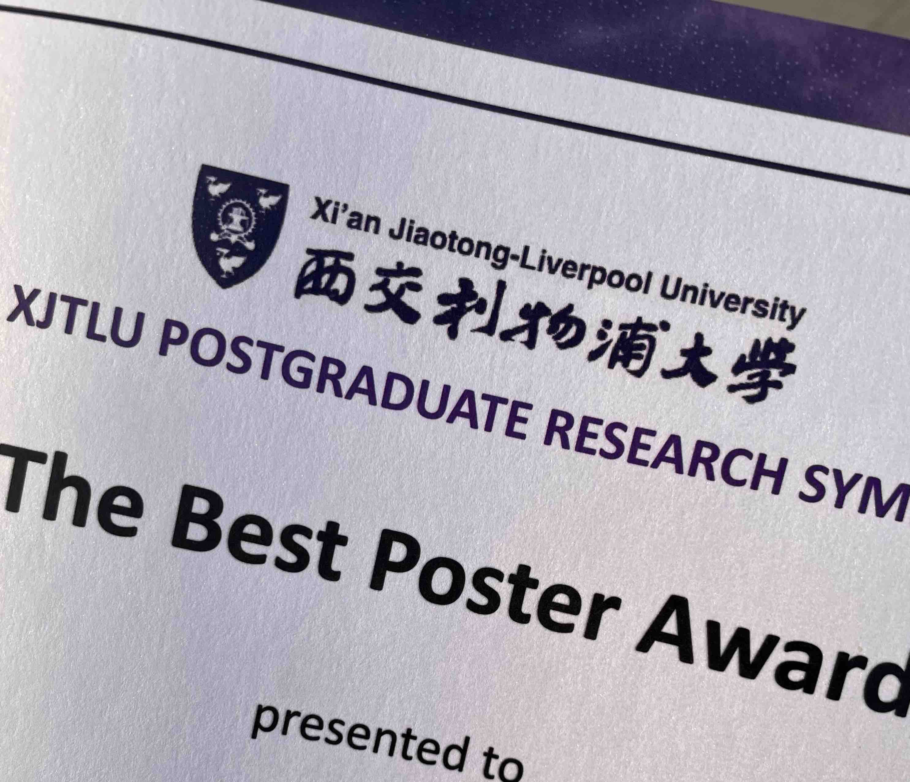{width="0.4\\columnwidth"}

### "我不想去"------尽量不要！

经常听到有同学这么想：奖励这么少，含金量又低，即使最后拿个最佳也没卵用。而且即使不去，最后也没能把我怎么样。是的，坦白了讲，一来，导师同意，就可以合法不去；二来，即使直接装消失，最后也不会怎么样，和毕业无关。

但，作为参加过poster、oral，也chair过三场oral、听过很多口头报告的老人，除非你作报告真的可以信手拈来，我真的强烈建议你们去参加！我见过有同学全程低头念稿，有同学直接把稿子写PPT上读，有同学过于紧张手和声音都抖个不停，有同学PPT分不清楚主次、重点不突出，有同学面对老师的问题手足无措。这些任何一项，放到你毕业答辩，都是致命的！！须知，咱答辩不是和体制内大学一样走个过场，是真枪实弹的必须要做好报告、再回答好每一个尖锐的问题。**你想要把这些问题直接暴露在答辩上，还是提前发现，多加锻炼，早些解决？**

所有，既然在Symposium里，你不会Fail，只会评奖，评委老师也都很友善，会帮你找出重要问题。所以，[**是非常安全的、绝佳的【锻炼机会】**]{.underline}。可不能等到答辩了或者等到你参加顶会了再去锻炼啊！

### 注意事项、如何表现出色

下面附上我在2022年symposium看到的口头报告打分表（可放大查看），poster的注意事项其实很类似（参加poster的，也需要准备一个3分钟左右的talk来给到场的评委老师介绍）。坦白的说，这些项目放在任何报告里都是值得注意的地方，可以用来仔细审视自己的海报。

<figure>
<table>
<tbody>
<tr class="odd">
<td style="text-align: right;"><embed
src="author-folder/Kai.Wu/2022_XPGRS_oral_judging_criteria.pdf" /></td>
<td style="text-align: left;"><embed
src="author-folder/Kai.Wu/2022_XPGRS_oral_judging_form.pdf" /></td>
</tr>
</tbody>
</table>
<figcaption>2022年的打分表</figcaption>
</figure>

如果你想表现出色、得奖，可以继续看下面的内容：

作报告和做海报，大家在网上都能搜到大量教程。但，XPGRS和其他学术报告最大的区别就是，绝大多数同学、包括学校的评审老师，非常有可能完全不知道你的研究领域（正所谓，隔行如隔山）。如果你按照跟你导师汇报的方式来讲，或者是把你在某次内行齐聚的学术会议上的海报/PPT原封不动拿来用，有可能是得不了奖的，因为，评委老师和其他同学确实听不懂。

我的导师告诉我，XPGRS因为是给外行讲，和学术报告其实不同，更偏向科普性质。如何在短时间内，让一个外行对你的研究感兴趣，并且搞懂个70%，也是Symposium的部分目的。如果你不知道该怎么做，可以想象有一天你在电梯里遇到了席酉民，怎么在短时间内让他知道你在做什么，又有什么用，最好还能让他感兴趣。或者是，过年回家跟你哪个亲戚或者老同学怎么讲清楚你在做什么。学术不是闭门造车，如何把自己的学术讲出去，让学术成果造福其他人也是很重要的技能。

::: flushright
(2022年10月19日 by )

(major update: 2022年12月16日 by )
:::

# 这些必须得看，不看吃大亏 {#fuli}

## 会议经费 {#sec.fund}

每位同学，无论是自费生还是奖学金学生，都有16500元的会议经费。参加会议的时候，可以用来报销注册费、住宿交通等费用。这笔钱毕业前不用完拿去~~在会议周边吃喝玩乐出去浪~~丰富自己的学术经历就亏啦。钱虽多，申请和报销流程比较繁琐。主要资料在：

-   e-bridge: <https://ebridge.xjtlu.edu.cn/>，登陆过后点击PGR Policies,
    Procedures and Forms，找到 *Postgraduate Research Students'
    Conference Fund Policy* 和 *Guideline and Procedures on Doctoral
    Student Travel Arrangement and Reimbursement*

-   官方流程图

    {width="0.9\\columnwidth"}

要注意

1.  必须要至少提前30天申请。因此不能用于"你突然听说有个30天内要开的会议"

2.  必须要在会议上作报告，poster或者oral都可以，否则不能使用经费

3.  不能使用学校经费的时候，可能可以使用你导师的某些经费。我就因为上述原因，用导师的经费报销过几场会议。具体怎么做&你导师到底有没有这种经费，问你自己的导师

::: flushright
(2022年10月12日 by )
:::

## 免费办公用品

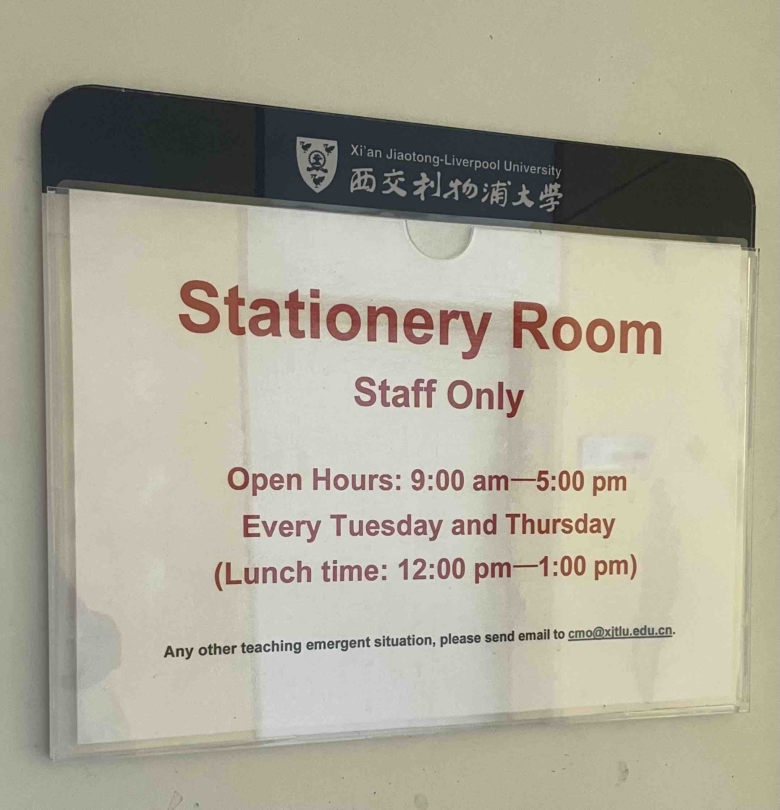{width="0.6\\columnwidth"}

除了大笔的会议经费之外，最让大家省钱的应该就是免费的办公用品了。学校很多楼里都有Stationery
room（办公用品领用室），里面所有东西都可以领取。抽纸、笔、马克笔、荧光笔、各种收纳架子、胶带胶水订书机，基本你能想到的都有。

哪些地方有stationery room：

-   MB128，周二/周四，上午9-11点，下午1-5点

-   BSG35，周二/周四，上午9-11点，下午1-5点（感谢匿名同学补充）

-   HS楼物业，周一/三，上午9-11点，下午1-5点，周五上午（感谢匿名同学补充）

-   其他楼？请读者补充

如何领取：

1.  第一次领取前，先直接跑到stationery
    room，问工作人员可以领哪些，会给你一个册子。你直接拍照留存每一页内容，这样下次就知道可以拿什么了。或者，可以在这里找到一份热心同学上传的历史版本
    [\[GitHub链接\]](https://github.com/kaiwu-astro/xp_pgrs_unofficial_guide/tree/main/fileshare)
    [\[不能上GitHub的用这个链接\]](https://gitee.com/kaiwu-astro/xp_pgrs_unofficial_guide/tree/main/fileshare)，但内容可能会变动而有少许差异。

2.  下载最新的 (CMO) Office Supplies Application
    Form，目前最新版本是V3。新版本发布后老版本一般是不能用的。如果这个过期了，更新的版本我们在哪里下载呢？很遗憾我们没法下载~~（吐槽学校一次）~~，一般方法是，问你导师要，导师一般可以在学校的box网盘里面找到。这里提供一个我在用的
    [链接](https://github.com/kaiwu-astro/xp_pgrs_unofficial_guide/tree/main/fileshare)
    [备用链接](https://gitee.com/kaiwu-astro/xp_pgrs_unofficial_guide/tree/main/fileshare)。

3.  如实填写内容。其中第一列\[办公用品名称\]一定要和上面那个册子里的物品名称一样。每次不能拿太多，拿东西的工作人员会审查。抽纸每次只能拿一盒。笔一般是按支拿，不能按盒拿（但是你可以写拿12支，就是1盒）。右边的理由，如实简单填写，比如抽纸-日用；笔-演算；订书机-整理；胶水-报销。最后，要你导师签字。电子签名应该不能用，也不能导师签完过后复印（这些都是之前版本常用的花招hhh)。填完后，在stationery
    room开放时间拿过去，就可以愉快的free shopping啦。

4.  202306更新：下面这些东西不用填表可以直接过去拿（其他的需要正常填表

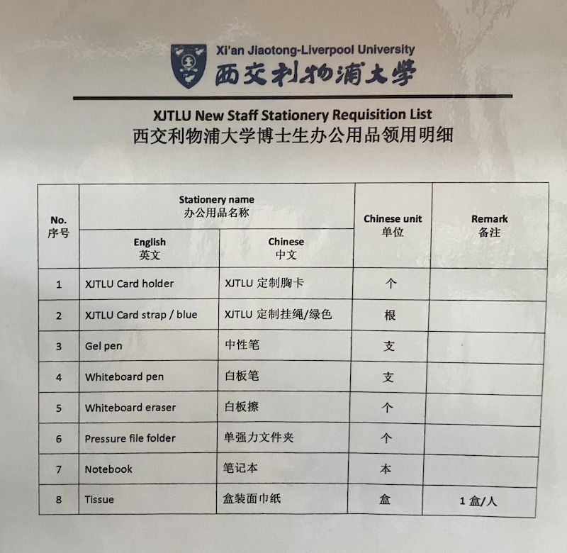{width="0.6\\columnwidth"}

::: flushright
(2022年10月12日 by )
:::

## 免费打印

每个9月，学校都会把博士生的打印费余额重置为2000元（可在
<https://myprint.xjtlu.edu.cn>
查询），相当于，每位博士生同学有几乎无限制的打印费。我个人就喜欢把论文全部打出来看。
如何打印，建议直接看官方文档。文件在本项目的GitHub里（[链接](https://github.com/kaiwu-astro/xp_pgrs_unofficial_guide/tree/main/fileshare)），或者下面的链接

-   本科生IT指南（中英文）：<https://gitee.com/kaiwu-astro/xp_pgrs_unofficial_guide/tree/main/fileshare>

-   打印指南（英文）：<https://guide.xjtlu.edu.cn/ss-print/staff>

注意，请不要用于打印整本书籍，这违反打印政策，可能会被查，但打书的个别章节一般是允许的。如果一定要打整本书，请淘宝。

::: flushright
(2022年10月12日 by )
:::

## 体育馆代金券

学校体育馆是商业化运营的，i.e.，要收费。但微信小程序【西浦体育中心】，每月会发放价值100元代金券，可用于订篮球场、乒乓球台、健身房时长等等。具体请进入小程序探索。其实学校健身房设施非常完备，也都很新。没去过的同学，尽早去探索下吧。代金券基本上等于\[会过期的余额\]，也就是会自动找零，比如你订25元的健身房，使用100元代金券，会变成75元代金券，但代金券有有效期。

订票过后，需要刷西浦校卡进入体育馆大门，再在对应场馆刷你订的场馆的二维码进入。

::: flushright
(2022年10月12日 by )
:::

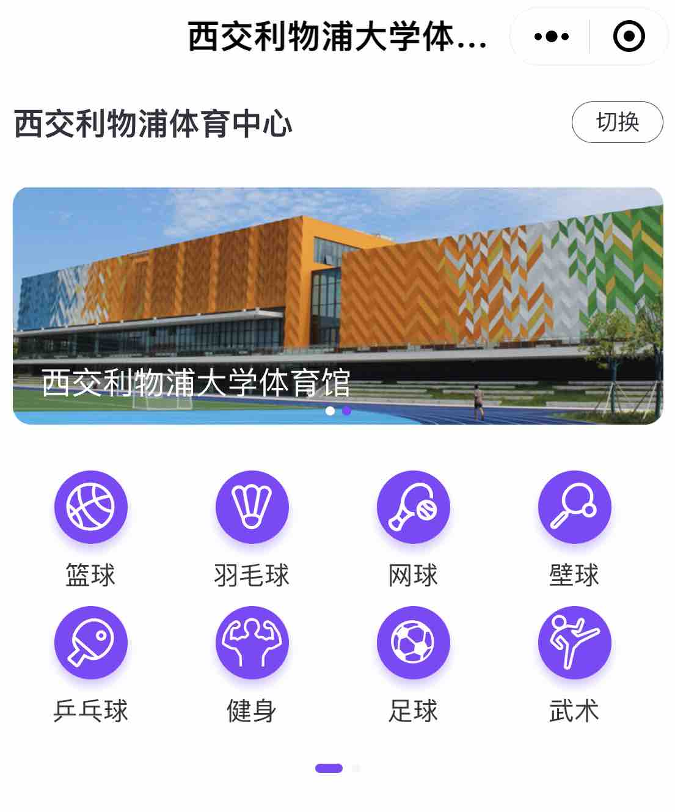{width="0.95\\columnwidth"}

## 利物浦账号自带福利 {#sec.fuli_liverpool}

-   Liverpool
    免费高级Zoom账户：<https://liverpool.service-now.com/sp?id=kb_article&sysparm_article=KB0011854>

-   Liverpool 免费
    Office365：<https://liverpool.service-now.com/sp?id=kb_article&sysparm_article=KB0010032>

-   Liverpool 免费 1T Onedrive 云盘 网页使用：
    <https://liverpool.service-now.com/sp?id=kb_article&sysparm_article=KB0011362>

-   Liverpool 免费 1T Onedrive 云盘 本地备份同步：
    <https://support.microsoft.com/zh-cn/office/%E4%BD%BF%E7%94%A8-onedrive-%E8%BF%9B%E8%A1%8C%E5%90%8C%E6%AD%A5-bb89981b-e382-4969-b8fd-d413a90b6db3>

-   其他Liverpool免费软件：<https://www.liverpool.ac.uk/it/software/software-downloads/>

-   Liverpool软件序列号：<https://www.liverpool.ac.uk/it/software/licencecodes/>

::: flushright
(2022年10月2日 by )
:::

## 其他福利

下面的内容，如果你完全没见过，可以花几分钟探索一下，留个印象，可能对以后很有帮助

1.  学校提供的IT服务：<https://guide.xjtlu.edu.cn/it-guide-for-student.html>，包括了免费的Office
    365

2.  (欢迎读者补充哦)

# 最好要知道这些

## 学术研究是怎么发生的 {#section.how-research-works}

### 学术经费

学术经费来源大致有以下三种：

-   政府机构及基金会赞助项目。国内有国务院、各省、各市提供的面向项目和面向个人的资助，国外也有政府支持的学会提供。这类项目一般金额大、影响力高，成功的申请记录对申请同一体系的项目有重要帮助。

-   企业合作项目。一般由项目负责人与企业接洽获得，大多数项目更关心落地。项目金额、完成度、影响力大小不一。

-   校内研究支持项目（RDF 等）。由校内 faculty
    申请，经学院筛选后由某委员会审核。项目数量不多、金额不大、周期不长，对职业初期比较重要。

学术经费并不直接进入项目负责人的私人银行账户，而是进入学校的科研经费管理账户。经费支出需符合指定的支出范围并受学校监管，常见的支出项包括采购、会议相关开支、劳务等。

当一次获得的学术经费超过某一额度后，导师可以获得跟经费数量对应的博士生奖学金（PGRS）名额。

### 期刊及会议

期刊及会议需要至少一个学术团体负责活动的举办。重要、活跃的研究者在学术团体中承担工作，如编辑、审稿人等，有助于吸引投稿参与。与之对应地，在学术团体中承担工作在一定程度上反映着研究者的声誉。

出版商发行出版物、举办会议需要资金支持。一般来说越重要、有影响力、有行业价值的期刊及会议，越容易找到赞助，需要作者支付的出版费用越少，活动的规模、丰富度以及质量越高。

期刊及会议的影响力在很大程度上受发表文章的被引用次数影响。越时髦的话题、重要的工作、知名的作者、重要的期刊，越容易被人阅读、引用。为了活动的可持续性，举办方也会优先考虑这些因素。

很多研究领域的研究者总数很小，参加会议能经常碰到至少读过论文的人，甚至审稿人、viva
reviewer。

### 社会效益

学术研究的一种意思是，在人类认知的极限处创造新知识。从这个角度看，学术研究对社会终将是有益的。

另外听说人文社科也很喜欢做社会影响力方面的工作，有机会再邀请人来写这部分。

不过考虑到我们还是活在一个商业社会，社会效益很多时候几乎直接等价于成果值多少钱，或者潜力多大。这也是我们物理空间上所处的环境。

### 导师

不同的导师特点都很不同，但大概可以分为应用倾向和前沿倾向:

-   应用倾向的导师一般会有更多的来自企业或政府的落地项目，或一些偏应用的来自政府的资助项目；

-   前沿倾向的导师一般会有更多的重要工作发表。

两者倒不是绝对矛盾的，只是时间、精力有限，总会有一定倾向。相对来说应用的机会数量多些，前沿需要的项目资金体量大些。由于导师的倾向不同，其所发展的各类资源也就不同，我们接触到的工作指导也会不同。

基于上面的原因，你大概能同意，很大概率我们会成为各自导师的样子。

另外对于人文社科，我听说的是几乎需要导师全程培养，有机会再邀请人来写这部分。

### 团队合作 {#subsection.teamwork}

在进行学术研究的时候，我们可能无法避免的会与其他研究者进行合作，这可能出于包括以下的多种原因：

-   研究经费。唔，毕竟人家出钱嘛，给出些意见并作为作者不是很有道理吗 ...

-   学术影响。唔，很有趣的是，在大家的经验之谈中，大牛参与的文章总被认为会有更高被收录的可能性...

-   私有数据。对于很多领域来说，数据不公开可能都是一个无可奈何的常态 ...

-   专业知识。很多研究都是跨专业领域的，而很有可能你并不了解所有的细节，这时候找一个熟悉某一部分工作的研究者就很有帮助，ta
    们可以帮你节省大量精力并提高研究效率。当然，唔，人选需要你认真考虑
    ...

-   实验工作。与专业知识类似，合适的合作者可以节省你大量精力。当然，唔，确实能听到很多人找本科生帮忙做实验并一起署名发表工作
    ...

另外，在你准备开始与除了导师团队中的其他研究者合作前，请务必阅读学校
e-Bridge 上的 [Guidance on Authorship and
Affiliation](https://ebridge.xjtlu.edu.cn/urd/sits.urd/run/SIW_FILE_LOAD.start_url?08F2CBCAE3174A7365Px9_5kBfG0_iGiWj8zb7ybwaO0YBYc8NiKlPG93xyQA9X2SClXOLLd7-_EgF50aijROwT-rdSGIUIbRRzhFu-76Ha0g2HymUr0S-Fgjm1DXP9RO1GhGzx5-akgsDSMBlNhR7vpib85F9vlqa67My7RKHFSiluZueFy52YCBtintt0wDTKmx4fCjkWnldNDaxo6ZVD2L572Us3V-FOv485wYZUNUn5NLzgR0pAaU7aiKnTVJY8Aa2su5F4u7o-rNPJPety3jwwJ4O1v1agpDZLZ1it1H5fWn3IgLNaWlUh84YpxNRXyTW1kIwrX0r4-dT1eoxdZUAFrJhaBwz6E0w)，或许可以节省很多麻烦。

::: flushright
2024年10月1日 by
:::

## 助教（Teaching Assistant）怎么做

### 我是否需要做TA？

-   如果你是全额奖学金的博士生（免学费+有津贴），那根据学校发给你的的Financial
    offer，你每学期都有TA的义务（换句话说，奖学金是TA工作量换来的，拿了钱必须做事）。做了TA过后，不会另外结算工资。2020年及之后入学的全奖博士，三年需要做满900小时助教方可毕业。2023年及之后入学的全奖博士，每学年需要做300-500小时TA或RA方可毕业。

-   如果你是2020年及之后入学的半奖博士生（仅免学费）或者自费生，则没有做TA的义务。做TA过后，学校会按照工时给你发工资，而且TA的经历写到你简历上，（视你未来的职业规划）可能有一些作用。

全奖每学年强制300小时TA，按一年40个教学周计算，每周都有7.5小时的duty，相当于每周费掉一天。肯定有同学要问，真的会这么严格吗？从具体执行的情况来看，不同学院之间有很大区别。有的学院甚至专门为此建立了一个数字化系统来统计你的工时，然后必须作满；有的学院就比较佛。因此具体执行情况，请问你同专业的学长学姐。

::: flushright
(2022年10月21日 by )

(major update: 2022年12月30日 by ：根据最新官方handbook修正TA时间)

(update: 2024年1月15日 by ：根据最新官方handbook修正TA时间)
:::

### 如何成为一名TA

每学期的第一周前后，学院会招募TA，一般由学院的秘书（School Academic
Administrator）联系大家。

-   半奖及自费博士比较自由，可自行与任课老师联系

-   全奖博士分两种情况：a.自行与任课教师联系 b.学院直接发邮件分配

如果你很想参加，或者想早点占某个科目、某为老师的坑，可以尽早联系秘书以及对应的科任老师。

::: flushright
(2022年12月30日 by )
:::

### TA的工作种类，以及分别怎么做

助教的工作包括不局限于

1.  批改作业及试卷

2.  给本硕学生上tutorial（商科居多）、上lab

3.  核算登记课程分数

4.  做一些辅助性的工作（如设置Learning Mall等）

5.  期中、期末监考

研究生院会组织TA培训，以*Teaching Assistant (TA) Training
Programme*为题的邮件通知，也可以直接在你的Learning
Mall上找到。每学期都有。如果一次都没去过，最好至少去听一次。下面是比较核心的、学校培训讲不太明白的内容：

#### 批作业

如果是传统的改线下的纸质作业，一般问老师怎么做就行。如果是通过Learning
Mall（以下简称LMO）提交的电子版作业，下面是教程：

1.  登录LMO，找到你做助教的课程。如果翻遍了都找不到，需要发邮件给你们学院的秘书或者任课老师给你权限。

    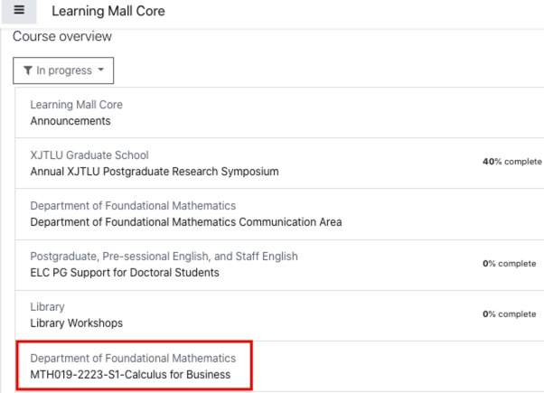{width="0.4\\columnwidth"}

2.  点进课程，往下拉找到提交作业的地方，或者直接用Ctrl+F（Mac：Command+F）搜索
    submission

    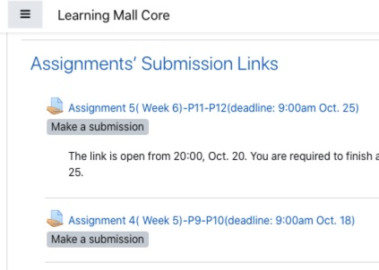{width="0.95\\columnwidth"}

3.  超大的必修课会有很多个班，先选择你被分配到改作业的班级（Seperate
    group）。接下来，如果你要马上开始在网页上在线批改，点击Grade。如果想看看，或者想离线批改（比如下载到iPad上），点击view
    all submission。

    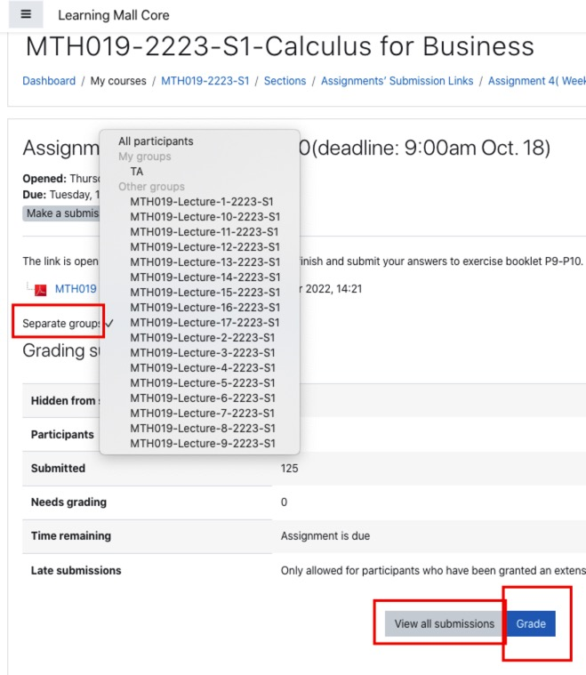{width="0.5\\columnwidth"}

4.  我对在线批改系统深恶痛绝，很卡，而且在线的PDF标记工具贼难用，改作业效率很低。除非老师做了打分表格（我导师给我展示过一次，在线批改的时候右边可以直接选择每个小题的分数，以及错误原因，这样就很高效，但我改过作业的module一个都没有做过这个），否则在线就很鸡肋。因此下面我只介绍我摸索出来的相对高效的离线批改方法。点进view
    all submission过后，在上面的grade
    action里，分别选择\[下载成绩表\]和\[下载全部提交文件\]

    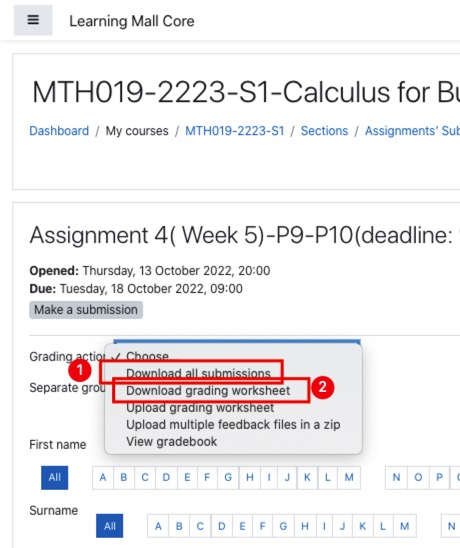{width="0.5\\columnwidth"}

5.  然后你就会获得一个csv文件和一个超级大zip。解压zip会看到所有学生提交的作业都以姓名+学号+一堆字命名好了。接下来你就可以把这堆文件在你电脑上、或者传到平板上本地批改。如果你的科任老师不要求把批改过的作业作为feedback
    file发回给学生（得问老师），你甚至可以全部打印出来改。改完过后，把成绩登到成绩表里。csv可以用Excel打开，你可以另存为xlsx格式。表格最后一列是Feedback
    comments，可以在里面写对学生要说的话，比如，文件格式不对、下次请拍清晰一点，之类的

    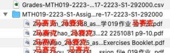{width="0.5\\columnwidth"}

6.  按照老师的要求改完作业过后，可以很方便的把成绩表和批改过的文件（如果老师要求）传回LMO。还是在刚才view
    all submission之后的页面，点击upload grading
    worksheet，把成绩表传上去。

    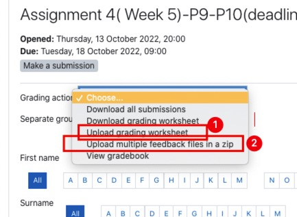{width="0.5\\columnwidth"}

7.  要注意，如果你中间用Excel把它存成了xlsx，上传前需要另存为UTF-8的csv格式再上传。勾选下面allow那一句，允许表格内容覆盖已经在网页改过的内容。点击下面upload过后，你会看到很长一串网页，每个学生的成绩（和你输入的feedback
    comments）就传上去了。

    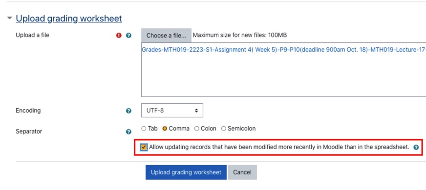{width="0.8\\columnwidth"}

8.  回到刚才的页面，点upload multiple feedback files in a
    zip，上传批改过的作业文件。把作业文件打包成zip上传，但由于LMO限制上传大小不能超过100M，如果总大小超过了就要手动打包成多个小于100M的zip（神烦，为什么下载就可以超过100M）。会用Python的，可以用我随便写的这个Python脚本
    [GitHub链接](https://github.com/kaiwu-astro/xp_pgrs_unofficial_guide/tree/main/fileshare/zip_in_100M.py)
    或
    [不能上GitHub的用这个链接](https://gitee.com/kaiwu-astro/xp_pgrs_unofficial_guide/tree/main/fileshare)，来自动按最大100M打包成多个文件（如果不会Python当然还是手动打包比较快）。上传完过后就完事了。

9.  最后要发邮件给老师，说明(1)发现的共性问题，比如某道题错得很多，某道题不会的很多，某道题有的学生错理解成了什么，之类的，(2)个别问题，例如某学生交错了文件，某学生疑似抄袭标准答案（这种一般是高年级学生给他的），某学生和某学生作业雷同，(3)以及其他任何想和老师沟通的问题。大学数学系有下面这种专门的反馈表，填到表里。如果没有反馈表的，给老师发邮件说下也可以。（一般都不用太详细，不要学我，很费时间，除非你热爱这项事业）

    {width="0.5\\columnwidth"}

【分享一下我的批作业经验】

1.  我的工具组合是iPad + Apple pencil + PDF Expert
    app，比在电脑上在线、离线改都快得多。另外如果购买磁吸类纸膜（约20元）+
    pencil替换笔头（约10元），会大幅提高书写体验

    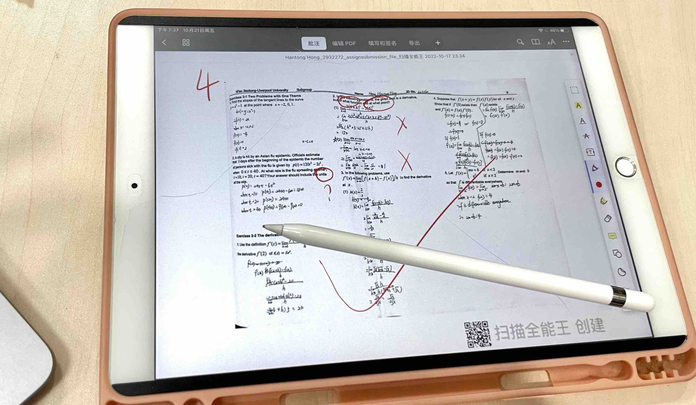{width="0.5\\columnwidth"}

2.  流水线提高效率：题多的时候，不要全部改完一个学生的作业再改下一份，这样尤其慢。尝试一下把作业分成几部分，先把所有作业的part
    1（比如，前面三道题）改完，然后回过头来，改所有人的部分part
    2（比如4-6题）。可能打开关闭文件会费一些时间，但这样能记住几个题的答案和评分点，改起来很快。切忌改每个作业都去看几眼答案。

3.  同理，不要改完一个就登一个成绩。我的习惯是，把总成绩写一个巨大数字在左上角。全部改完过后，传电脑上，用最大号的缩略图（Mac：显示为图标，狂按command+等号；win：显示为超大图标），直接不打开文件就能看到左上角的分数。Excel里按姓名排序，文件夹里用名称排序，统起成绩来特别快。

    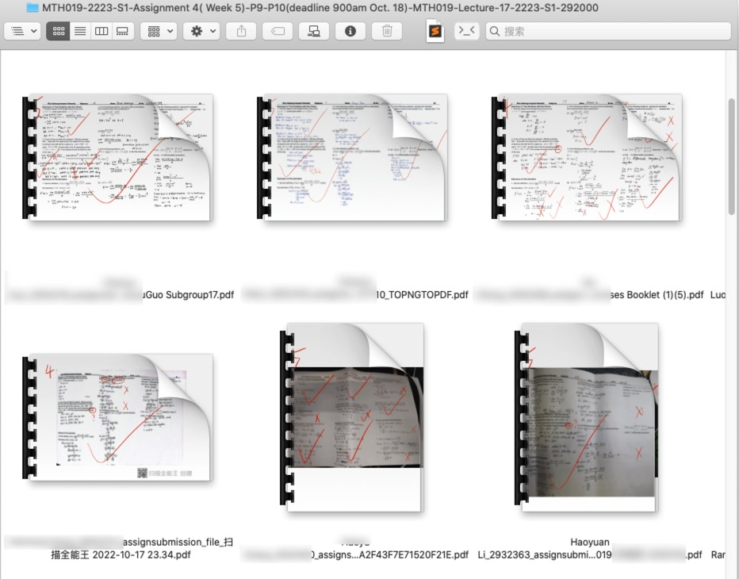{width="0.7\\columnwidth"}

4.  学生提交的文件可能有很多大病。比如，提交的不是pdf而是word甚至ppt、提交的pdf里面图片顺序是乱的、图片方向是错的、有标准的习题册不用而是自己拿个本写导致不好对答案。TA有权要求学生交作业的格式，可以对这些学生在feedback
    comments里面警告，并且提醒科任老师一定要在课上提醒学生，否则真的非常影响批阅效率。学生警告了仍然乱交格式时，可以按你的标准扣格式分。比如我的标准是：初犯警告，再犯扣20%，三次扣50%，四次扣完。

5.  有时候文件巨大或者文件中有太多手写字迹，会导致pdf打开加载非常慢（一分钟甚至几分钟），而且容易崩溃。前者可以要求学生自行压缩PDF，后者实在是没办法。我写了一个Python程序[\[GitHub链接\]](https://github.com/kaiwu-astro/xp_pgrs_unofficial_guide/tree/main/fileshare/pdf_to_png_to_pdf.py)应对这种情况，会在下载完所有作业过后把所有PDF转成图片再转回PDF，这样打开就不成问题了，文件大小也都能压缩到5M以内。需要的自取，但使用有点麻烦，不过我实在找不到其他更科学的方法了。

6.  （悄悄说）拿不准给多少分合适的时候，就给多一点。给少了，学生会找你argue，很浪费时间。给多一点，相当于节约自己的时间。

7.  往表格登成绩的时候，难免犯错，登错或者登串成绩。初次或者前几次登成绩尤其容易出问题，可以考虑全部double
    check一遍。另外，如果你把成绩写在了PDF左上角，能一定程度解决这个问题，也就是如果成绩登错了，学生发现LMO成绩和PDF上的不一样，能马上联系你。

8.  改完作业后，学生有可能会通过LMO给你发消息，或者给你发邮件。尽量不要直接回复学生，毕竟回复错了的话老师背锅。任何学生发给你的消息，请转给老师，让老师回复他。除非老师同意你直接回复。

::: flushright
(2022年10月21日 by )
:::

#### 批改试卷

Quiz，期中，期末考试，助教有可能要参加评卷。所以期末放假跑路之前跟老师问清楚，以免要改期末卷但是不知道。如果确实有事要提前跑路，和老师商量。

#### 带Lab（实验课）

像大学物理实验这种课，会让TA带实验课。物理实验的讲课流程一般是：先在实验室的白板给学生讲一下实验原理、数据如何记录和处理、注意事项，然后要亲手演示如何做实验。课后，要批改实验报告。

我感觉，实验课非常有挑战性，因为确实就是实实在在的在大学里讲课。你需要自己花时间备课、准备讲稿、理清思路、准备学生可能问的各种问题；讲课前科任老师会对TA在实验室培训，你自己得先吃透如何做实验。还有突发事件如何处理，比如学生弄坏器材（及时问老师）。因为实验课就那么几节，总的工作时长加上批实验报告也比大部分其他课的批作业时长要少，但是非常锻炼人。可以挑战自己，如果不想干也一定要尽早跟老师、学院秘书提出换到其他课程。

::: flushright
(2022年10月22日 by )
:::

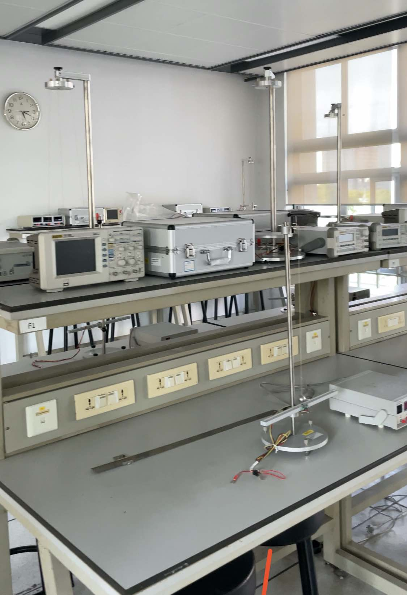{width="0.95\\columnwidth"}

#### 如何做好讲Tutorial（习题课）

1.  课前做好充分准备工作，当你站上讲台那一刻，你就是一名教师了，要为自己说的所有的话负责，也要对学生负责。课前将课程所需要的材料拷到U盘中，进入教室后打开电脑登录自己的账号即可使用电脑。同时你也需要使用账号登录LM,
    AMS等乱起八糟的系统。由于学校电脑较卡顿，建议大家提前十分钟到达教室。此外，也需要提前十分钟下课，否则会被后面上课的老师和学生投诉你拖堂。

2.  课后耐心回复学生的邮件与提问。此处给大家一个忠告，不要加轻易加学生微信，让他们有事有问题跟你邮件联系。否则你会变成一个7\*24客服。邮件作为学校官方交流方式，很好的保护了教师和助教的私人空间和权益。曾经有学生投诉，就因为助教没有回复学生的微信。

3.  有问题及时跟module
    leader沟通，遇到棘手的问题，不要自作主张，需要与module
    leader商量。学生给的反馈，也可以与co-teacher沟通，以提升学生的学习体验。学生体验感好了Module
    Questionnaire（MQ）分数自然就上去了。MQ的分数即学生评教分数，如果分数好看，求职的时候，是可以放到简历里的。

::: flushright
(2022年12月30日 by )
:::

### TA工资是多少，怎么结

2022年TA工资是60元/小时，每月一结，次月月底发钱。例如，2月底发1月工作的工资。

另外，期中、期末考试的监考也是TA的一种，会计入奖学金学生的TA工时，对自费同学，监考的工资单价一般也高得多。监考见下一节。

## 监考怎么做

### 如何参加

全奖博士如果没有做满规定的TA时长，这时候学院就会给你安排监考。监考一学期只有两次，期中考和期末考。由于近两年疫情，很久没有线下考试啦。

遇到考试较多，教职工和全奖博士不够用的情况，非全奖的博士也可以报名做监考员。具体的方式就是等待学校发邮件邀请，会有一个链接，让你点进去选择心仪的时间。选完之后过几天就可以在e-bridge上查看具体的监考安排啦。

监考的工资单价，2022年是60元一个小时，准备工作比较少，监考途中基本也就是走一走，相对轻松，对于非全奖是不错的挣钱方法。

### 具体怎么做

首先学校有监考的培训，在*Teaching Assistant (TA) Training
Programme*为题的邮件里的Assessment and
invigilation那一项就是，或者是在你的LMO里翻一下。如果一次都没去过，可以考虑去听一下大致的流程。

一个考场的监考分为senior invigilator（教职工）和invigilation
assistant(博士生)。

我总结下来监考的流程是这样

1.  上面说的监考培训，虽然不是每次都必须听，但按照惯例，是在每学期培训的时候发\[监考员工牌\]。监考时必须佩戴，监考完必须还回学校。所以，即使不想听也至少要跑一趟去领你的工牌。如果更懒（比如我），一般让办公室其他要监考的同学代领（一般是办公室派一个人把整个办公室的都领回来）。

2.  在ebridge上查到自己的监考安排，如下图

    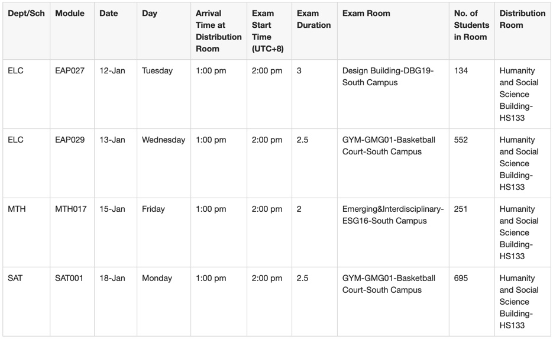{width="0.5\\columnwidth"}

3.  监考第一部分：考前准备。开考前，注意上面表格里的两列：\"Arrive Time
    at Distribution Room\" 和 \"Distribution
    Room\"，在指定时间，提前去签到并领取试卷。然后会拿到MCQ
    card、答题册、考场名单、小白卡、黏土等资料，拿到考场去

4.  到了考场，第一件事是粘贴资料。考生名单里，有一份按学号排序的是用来贴在门上的，给学生找自己的座位（其他几份按座位排序的是给监考员自己拿着的）。把这一份资料每一页分开，用黏土贴到考场门上或者墙上。

5.  然后开始分发答题册、答题卡。对照考生座次发。

6.  一般一个考场会有多个监考。其他监考员来了过后，分一些发答题册、答题卡的任务给他们。然后，跟他们商量每个人负责的区域，每人负责一个区域的监考巡视、收资料等工作。

7.  主监考（监考老师）会带着试卷来，然后帮老师发试卷。如果主监考在开考前20分钟还没到，需要联系监考员微信群里的老师催促。

8.  开考15分钟前，必须所有资料（试卷、答题卡、MCQ等）发放完毕。考试前15分钟，让学生入场。

9.  多个监考员在场时，一般每个入口留一个以上监考员查学生卡，没带学生卡或身份证的不准入场。其他监考员，可以在考场里走动，特别注意学生在开考前不许打开试卷册，如果发现需要立即制止。如果比较多，要让主监考警告学生。为防止丢失，学生的背包不要放到考场外，让学生只能放到考场最前面或最后面。

10. 主监考宣布开考后，对于你负责的那个区域，记录迟到的学生。可以记录在你的监考名单上。

11. 开考后，随便转悠，享受你作为监考员的权威。重点检查学生的随带物品，手上或纸条是否有小抄等。监考过程中，不可以看手机或者闲聊，需要观察学生是否有作弊现象。若遇到作弊的，需要当场指出，停止学生考试并在试卷上做出标记。

12. 开考后30分钟，收小白卡（一张专门用来写姓名学号等信息的卡片）。收完过后，记录你的区域的缺考的学生。

13. 如果有学生没带笔、铅笔、橡皮要借，问主监考如何操作。如果有学生要上厕所，需要监考员跟随过去（跟到厕所外就可以了，虽然貌似也不用提醒）、跟随返回。同一时间，原则上只能有一个学生上厕所。如果有第二个要去，需要考生等前一个回来。

14. 最后就是考试结束，收所有资料，包括草稿纸（如果有）。学生必须要等你们收完了、点清数量无误，才能起身离开。

15. 考完过后，统计到场、迟到、缺席等情况，让主监考记录在记录表里。最后，有两张纸需要所有监考员签字。有这两个签字 +
    一开始的签到，才会成功记录你的工作。

16. 然后就是say
    goodbye了。监考老师会拿走答题册、MCQ。你们需要把前面签字的两张纸和所有监考老师不要的资料（包括试卷、草稿纸等）拿回一开始签到的地方。如果这是你本学期最后一次监考，需要把你的监考工牌也还回去。

最后分享一个我做了十几次监考过后自用的checklist

1.  拿东西的时候看监考员人数，方便分区域

2.  到考场贴座位表

3.  跟老师确认

    1.  收答题册按顺序？如果要，考试结束不要让学生传卷子，缺考的、提前交卷的也放在桌子上

    2.  贴？如果要，考试结束让学生贴

    3.  是否要记录上厕所和开始结束时间

    4.  缺考的怎么处理（小白卡、答题册 帮填信息，答题册写Absent）

4.  拿到座位号先按监考员数量分区域，区域作用：除了收卷子都负责

    1.  考前：发卷子，查看区域是否坐对了座位，看学生不要打开白色问题册

    2.  放学生：门口检查学生卡

    3.  0-30分钟：查看坐对座位，记录迟到

    4.  30分钟：记录absent，收小白卡。之后填写学生到场情况表

    5.  上厕所：记录上厕所的座位号、开始结束时间

    6.  -15分钟：记录提前交卷座位号、人数

5.  结束前：提醒老师让学生粘answer booklet

6.  结束后：按顺序收answer，清点自己收的部分，拿到一起后再随机清点一部分

7.  分块列表：人数、缺勤、提前交、剩余、特殊

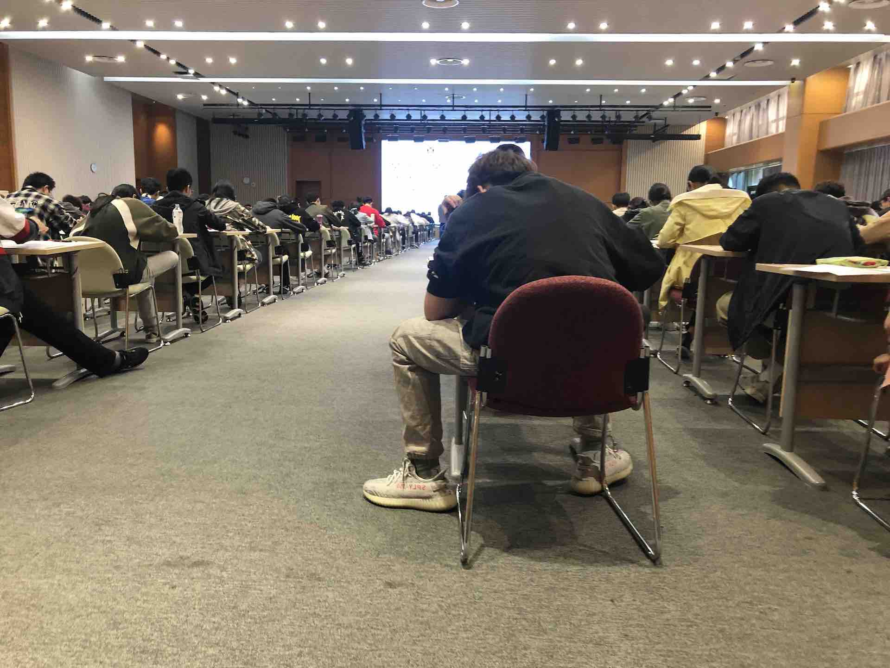{width="0.9\\columnwidth"}

::: flushright
(2022年10月22日 by )

(major update: 2022年12月30日 by )
:::

## 学位论文，论文答辩，和毕业 {#sec.thesis_viva_graduation}

你想毕业吗？你想成为Doctor吗？那就赶快看这里吧！只要一篇一百多页的论文，毕业不是梦！~~（发癫结束）~~

### 官方流程和时间线 {#sec.official.flowchart}

正如本攻略的宗旨是官方资料的补充，首先请尽量熟读下图的官方毕业流程，里面的时间线、条件和顺序都是万分准确的。

{width="\\columnwidth"}

如果想直到每个步骤大概要花多少时间，跳转章节
[5.4.5.3](#sec.graduation.time){reference-type="ref"
reference="sec.graduation.time"}。

### ITS: Intention to submit

Q：ITS重要吗，我着急写论文呢，暂时不管它行不行

A：如果你对毕业时间有要求，请务必谨记尽早提交ITS表！ITS是你的论文和答辩一切程序的开始。现有规定，你的论文只能在**提交ITS之日起+2个月之后**才允许提交，可以延后，但不允许提前。（ITS提交后，一年内必须交论文；和你本身的论文deadline共同作用，以早的那个为准）

Q：ITS里面会填什么

A：毕业论文的题目、毕业论文的摘要、基本个人信息。题目和摘要不需要是最终决定的版本，也就是后面可以改。

Q：那我随便起个题目和摘要，走个过场行不行啊

A：这个表的作用是：导师和研究生院会拿着这个标题和摘要去决定你的内审、外审。这个题目和摘要也会发给他们。因此，和最终版可以有修改，但是也要尽量准确的反映你这几年的研究。

Q：我还要问

A：先看看官方文件：<https://www.liverpool.ac.uk/aqsd/academic-codes-of-practice/pgr-code-of-practice/>

### Thesis: 学位论文/毕业论文

#### 格式和排版

官方文件：<https://www.liverpool.ac.uk/media/livacuk/tqsd/code-of-practice-on-assessment/annex-7.1-PGR-CoP.pdf>
\<-- 一切对格式不确定的请以这个为准。下面是微信群里的一些日经问题。

Q：可以用什么软件写毕业论文？

A：根据上面的规定，利物浦对软件没有要求，也就是你想用什么都可以。常用的有：Microsoft
Word, LaTeX

Q：推荐用什么软件呢

A：LaTeX优点：(1)非常方便输入公式，(2)参考文献和引用处理起来非常方便，不需要Endnote等外部软件辅助，(3)格式美观，风格统一，排版很难难看，(4)文件小，文件可分散，方便备份。LaTeX缺点：学习成本较高。如果你们专业发期刊论文/会议论文都不用LaTeX而用Word，那你切换过来就要花些时间学习。

Q：上面这个排版要求文件要求好多好细，呜呜呜给我一份毕业论文模板吧呜呜呜呜

A：

1.  Word还真的有一个官方模板，可以在本项目fileshare下载<https://gitee.com/kaiwu-astro/xp_pgrs_unofficial_guide/tree/main/fileshare>。来源：ELC
    Thesis Writing Camp的老师

2.  LaTeX没有官方模板，但数理学院（SMP）的大部分毕业生都是用LaTeX写的毕业论文。可以直接在Overleaf模板库直接搜索Liverpool
    Thesis，应该只有一个搜索结果，采用即可。

3.  请使用模板的同学特别注意，never fully trust the template!
    Word模板是西浦ELC的老师给的，不是利物浦给的；Overleaf更是民间模板。理论上，他们对你的论文和毕业都**不负责**。因此拿到模板过后，第一件事永远还是打开上面的Code
    of Practice，一条一条的比对看是否达到了要求。

#### 字数

Q：上面的CoD只说了一个字数上限，那最低字数要求呢？

A：另一个日经问题。我曾经在研究生院Thesis Writing
Camp课程上问了老师，他的意见是，西浦Master thesis的字数上限是3w，因此PhD
thesis最好超过这个数。但我后来发现不是这回事。我见过有的论文不到100页，有的接近200页，都毕业了。从全校来看，这个是真的没有要求。你如果不放心，还是想对最低字数有点数，很简单，去利物浦图书馆和西浦图书馆下载毕业论文，重点参考你们学院、你们系、你们专业、最好直接是你同门已毕业同学的毕业论文，有多少字有多少页。**请谨记，字数多并不能保证你能轻松毕业**。我的一个师兄thesis就是接近200页，吃了个大改，外审说他写得太多了像教科书。

::: flushright
(2024年08月12日 by )
:::

### 论文答辩

#### 答辩前后流程

1.  在e-bridge上正式提交论文之前至少两个月，由指导老师选定好未来答辩的考察老师名单，交由XJTLU的pgsupport以及利物浦审核确定。

2.  在e-bridge上正式提交论文后，学校会联系对应的考察老师，之后再联系博士生候选人确定答辩时间以及答辩方式（答辩时间一般在提交论文的1-3个月内，答辩方式分为线上线下两种，具体可以跟pgsupport沟通确认）。

3.  一般来说，答辩之前会有一次预演，可以用来测试网络以及ppt展示。也可以另外申请时间去对应的会议室讲演ppt。

4.  答辩前，考察老师们会先内部开一个通气会，一般来说是当天（但也有提前时间的），然后再邀请你进入会议室正式开始答辩。除了两位（或三位（特殊规则下））考察老师外，还有一位观察老师（负责整体流程推进和休息安排，并回答你的流程相关问题，在正式答辩阶段，基本上不会说话），如果有任何问题，都可以问他。

5.  ppt讲完是问答流程，根据具体情况，时间在一个半到3个半小时是比较常见的情况（历史上也出现过7个小时的）。问答流程结束后会请你离开会议室一段时间，老师们进行结果讨论。大约10-15分钟后，请你进去并现场告知结果。

6.  考察老师的修改意见报告会在10个工作日之内发给你，根据具体的情况你需要在规定的时间内进行修改并交由主审考察老师确认。

7.  确认无误之后把最终版本的论文上传，这个流程就算是结束了。

::: flushright
(2024年07月05日 by Ziwen Xie)
:::

#### 如何准备好一场答辩

来自理学院的经验：

*尽量不要堆在两三天内做这些，把内容稍微分散一点，利于每天保持好状态，维持好状态进入正式答辩相当重要。*

**一.
至少完整的逐字逐句的读完自己的thesis一遍，假设自己是个全新读者，边读边思考下列问题**

1.  某些段落会不会不够清楚

2.  某些概念是否自己已经完全掌握能独立解释

3.  章节与章节之间的联系与区别自己是否明白，以及整体文章排布顺序的内在逻辑

4.  章节内部的小段落，实验设计顺序之间的内在逻辑

5.  每个或者某几个实验能一起或者分别说明什么问题，每个大章节能总结出什么结论

6.  具体引用的文献里的一些算法，一些模型，一些基础概念自己是否完全了解为什么是这样的。他们在文章中有什么关联性（与你的核心实验目标）

7.  有没有之前没发现的表述错误或者图表错误（之后也需要改的）

8.  你做这项研究的目的是什么，选择某种方法的动机是什么，比其他方法有什么优势

**二.
整理好上述问题之后，一章章（abstract也含在内）的进行拆分来进行细节分析，包括：**

1.  所有背景知识相关介绍的内容，自己能否用自己的话大概表述

2.  每个小标题表达的内容是什么，整章节内的小标题统一性

3.  具体实验的或者实验设计的亮点或者核心逻辑

4.  具体实验结果之间的递进、并列或者其他关系和区别（比如A实验说明了a，B实验说明了b，a是进行实验B的逻辑基础，这就属于递进。如果a和b方向内容相同那就是A和B并列）

5.  实验对象的选择和实验模型的选择的原因（也包括为啥不用别的相关或者类似的对象和模型）

6.  基于获得的结果，还有什么是可以未来去尝试的（这个部分可以很多相关问题，包括为什么不做某些实验，未来做某些实验是为什么，未来做某些实验可能能得到什么，未来的某些实验的基础设想和实践难度（也就是为啥你现阶段没做，但是你考虑了））

7.  Abstract要包含关键的结果和创新点

**三. 最后做ppt和viva的时候的相关重点**

1.  一共二十分钟，可以分成四个部分（背景介绍，实验设定，实验结果，推断结论）。每个部分5分钟左右，尤其结尾部分，前面三个部分可以适当简短，毕竟考官都读过你的文章了。

2.  打印好你的文章带去现场，边问答边做笔记（同时也给自己一些喘息时间（通过记笔记））

3.  重点图表结果在ppt内展示，并附上简短的结论描述

4.  不太需要讲遇到的问题，也不需要着重讲未来能做的实验或者设计（考官可能会问到，或者你回答某些问题的时候会答）根据具体情况，这部分可以放弃ppt部分讲，节约时间。

5.  确保ppt能正常运行，字和图片都看得清，提前测试的时候，尽可能自己模拟实际讲的情况过一遍

6.  答辩过程中记得喝水，但是慢慢喝，少量多次比较好。开始之前吃一些能量多好消化的食物，实在吃不下也吃点巧克力什么的或者弄点提神的饮品。开始之前多提前点到，熟悉环境有助于放平心态（也记得提前上厕所）

7.  回答问题的时候可以横跨整个文章，有的章节内的点可能是在后续章节里有联动的，或者未来计划和最终结论相关的。如果遇到考官提出，自己确实没想到或者没做的，该说不知道就不知道，并且提出需求，希望考官在反馈部分明确相关信息的处理办法或者信息来源（方便你后续改的时候知道去哪找东西）。

8.  一般来说每个问题的问答大概3-5分钟最多，两个考官的情况下，每个老师20个问题就算不少了。所以一般情况下是两个小时到两个半小时，中间会有休息时间的（不过等真的开始了，你应该不太会顾得上时间变化）。

**四. 非论文相关问题**

1.  人工智能和Chatgpt能如何inspire你的研究？

2.  你的研究可以应用到其他类型的数据/疾病/领域吗？为什么？

3.  你认为你的专业存在什么样的缺点？

4.  你在读博几年中的最大收获是什么？

5.  如果再来一次，你还会选择读博并做这个项目吗？

Tips：感觉老师就是比较好奇聊聊，放松回答就行。**最后来源于PGsupport某老师的数据，咱们建校以来从未有过Fail的答辩结果，因此大家不要太担心，正常发挥就行，祝好运。**

**五.
问问自己的老师能不能帮你设想一些问题，另外如果时间充裕，能不能让自己的老师给安排个模拟viva（可选项）。也鼓励去找自己的前辈们在他们答辩结束后去及时咨询相关情况，毕竟每年情况可能多少都会有一些变化。**

::: flushright
(2024年07月05日 by Ziwen Xie)
:::

### 我想尽快拿学位证！如何速通毕业流程

急急急，你就是急急国王。下面是一个合格的急急国王必须知道的事。

#### 毕业的证明文件

1.  完读证明（Completion of Studies
    Certificate），由西浦研究生院开具。证明内容：已提交毕业论文，已通过答辩，即将在XXXX年X月的毕业典礼上授予博士学位。我的Example：

    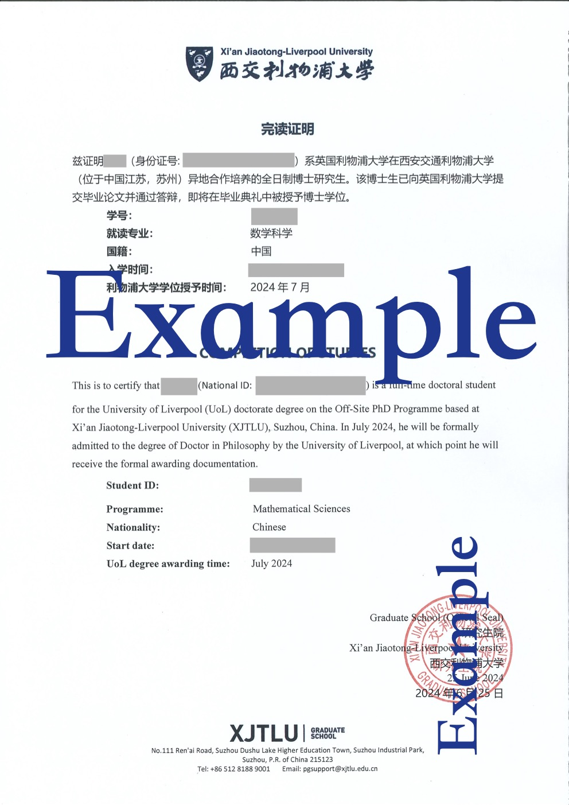{width="0.8\\columnwidth"}

2.  学位证（aka PhD degree, degree
    certificate）。注意！利物浦规定，学位只会在**利物浦**毕业典礼上颁发，而利物浦毕业典礼一年只有两次，一般是7月某天和12月某天。如果你不去利物浦毕业典礼，会在毕业典礼前后先给学位证的电子版（有法律效力，可办中外合办认证），然后原件慢悠悠的邮寄到西浦。

3.  中外合办学位认证。拿到电子学位证即可办理
    <https://zwfw.cscse.edu.cn/>。持有该认证，你的利物浦学位就在中国境内被教育部承认。

因此，首先确定你要去的公司/单位能接受哪种证明文件。最松的情况，你答辩完收到利物浦确认的Pass
(with minor/major
modification)邮件就行。也有能接受完读证明的。如果对方比较死板，不见学位证就不行，甚至没有中外合办认证也不行，那就要特别规划好毕业进度，因为每年只发2次证！

#### 学位证：最关键时间节点

如果你确定不需要赶时间拿学位证，那本节接下来的都可以忽略，因为完读证明任何时候都可以开。

Q：我能否在7月/12月毕业？硬性要求是什么？

A：最好的方式是直接上利物浦网站查询，或者直接google liverpool phd
graduation。过去几年的要求都是：在某个时间点之前，利物浦图书馆确认收到你的~~终极完全不改版的~~最终论文。例如，如果要参加2024年7月15日的利物浦毕业典礼（在这一天颁发学位证，或邮寄），需要在2024年6月25日之前，利物浦图书馆确定收到了最终论文。这份论文是你的内外审都满意、同意的最终版。如何走到这一步？看下一节。

#### 每个步骤要等多久？如何预估时间？ {#sec.graduation.time}

以下完全基于已毕业同学的经验整理。新毕业的同学，请不吝赐教，补充你的真实案例。

以 [5.4.1](#sec.official.flowchart){reference-type="ref"
reference="sec.official.flowchart"} 中提到的流程图来梳理：

1.  ITS：你提交过后其实就不用管了，专心写论文吧，剩下的都是导师和研究生院的活。背后的流程：i.
    导师propose内审老师、外审老师;
    ii.研究生院审核，可能因为觉得这个老师和你利益相关等原因驳回其中的某人，然后你导师重新propose，直到研究生院满意为止，定下来内审外审人选各一个。在这个阶段，严格来说你直到论文提交都不能直到内外审老师是谁，导师需要保密，所以也不要**太**为难你导师去问是谁。

2.  首次论文提交 到
    论文答辩：（30天±30天）提交后，西浦研究生院（XGS）和利物浦学位办（RDA）会花两三个工作日简单处理下论文，发给内外审。**内审**一旦收到论文，就负责安排答辩时间。也就是说，你的答辩日期完全取决于你+内审+外审+独立主席（independent
    chair）都有空的某个时候（正常2-3小时）。因此，最早答辩日 =
    论文交了过后三四个工作日；最晚答辩日则没有规定，找到四个人有空的时间为止。如果你赶时间，你能做的：(1)论文提交过后，尽早找你的内审，催ta安排日期；(2)把你论文提交过后一两个月的日程尽量腾空，不要因为自己的日程耽误答辩；(3)内外审一旦决定就不好更换，但独立主席容易换（有时会出现答辩一周前主席没空，找人另一老师顶上的事情），如果你们四个人里面是主席时间不合适导致拖很晚，尽早找你导师看能不能换主席。正常来说：交论文+60天=答辩
    算非常慢的（但也有例子，据说是交论文前后不巧遇到了利物浦搞罢工）。一般会在+30天左右。

3.  答辩完成 到 最终论文通过：（0 -
    180天，典型为3-4周）。根据答辩结果不同这一步会有很大区别。(1) Pass
    (无条件) = 0天，论文初版即为最终版。(2) Pass with minor modification
    （小改），绝大部分同学都是这个结果。（3）Pass with major
    mofication（大改）（其他比较惨的情况很少，~~建议让导师和他举荐的examiner打一架~~）。如果是2或3，内外审会在10工作日（=2周）内出具书面的修改报告。这个过程个人建议不要催，他们要交的表和报告不少。之后就取决于你能多快改完论文。改完过后，按利物浦邮件指示，把改好的论文用指定的方式发给老师。这一步完全取决于你的内外审老师多久能respond，以及他们对你的修改是否满意。因为按照流程，如果不满意，他们有权让你改到他们满意为止。为了避免反复迭代，建议和导师反复斟酌新文本，争取一次搞定。这个版本的论文不会自动作为最终版，你可以在里面用颜色或者加粗标注修改过的地方，方便两位老师查阅。

4.  最终论文通过 到
    利物浦图书馆确认收到：（7天）这一步只是行政手续。在通过后，RDA会发邮件通知你上传最终论文（我的情况：内审老师告诉我\[他们已告诉XGS和RDA修改版通过\]，过了4天收到上传通知），然后你将最终论文发送给利物浦，过几天（我的情况：2天）就收到利物浦图书馆正式通知邮件，论文成功上传。

5.  实际还有一些手续，比如西浦会也让你上传一份到西浦图书馆，不知道是否会影响毕业，收到通知过后也最好尽早完成。

6.  电子degree：具有法律效力的电子版degree会在你毕业典礼日期的前后几天内颁发。按照利物浦给你的邮件，在verify.liverpool.ac.uk里查询。

7.  纸质degree：如果你人去利物浦参加毕业典礼，那就是现场领取。如果你不去，会在你毕业典礼日期后官方邮寄到西浦，等就完事了。我的情况：7月15日利物浦毕业典礼（人没去），纸质版7月30日寄到了研究生院。如果到时候人已经不在学校，可以委托研究生院邮寄（不推荐，丢件没法补，风险自担）。

::: flushright
(2024年08月12日 by )
:::

## 和就业有关的重要信息

关于学籍、学历、就业材料等，首先建议到学校就业中心阅读FAQ：<https://careers.xjtlu.edu.cn/Dispatch/Home/Master>

### 学籍·学信网？

我们在读期间，学信网是查不到学籍的，但可以去教育部中外合办监管网站查
<http://rzzccx.crs.jsj.edu.cn/>
。所以海底捞大学生优惠这种必须要学信网验证的东西就不要想了，享受不了。Apple
Store是有机会享受的，每年政策不同，建议直接打Apple Store线下的电话问。

毕业后，你的利物浦学位要办理教育部认证才能被教育部认可，详见章节
[5.4](#sec.thesis_viva_graduation){reference-type="ref"
reference="sec.thesis_viva_graduation"}

### 成绩单？

不像国内的博士项目，我们毕业的时候没有成绩单。成绩单在利物浦对应"HEAR报告"，但有同学问过利物浦官方，明确告知博士生没有HEAR报告。如果你的就业单位死板要求成绩单，可向利物浦发邮件询问。

::: flushright
(2024年08月12日 by )
:::

# 其他攻略

::: flushright
------看一眼不亏，看两眼血赚
:::

## 大坑：假如明天你突然丢失电脑所有数据怎么办？------如何备份资料

<figure>
<table>
<tbody>
<tr class="odd">
<td style="text-align: right;"></td>
<td style="text-align: left;">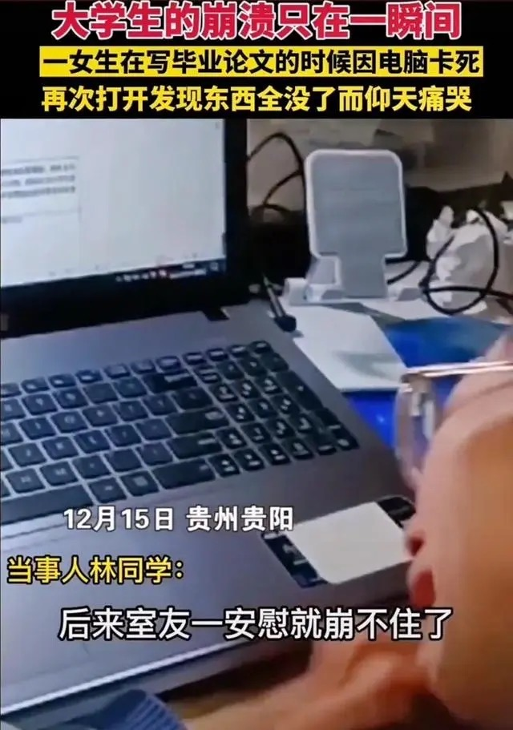</td>
</tr>
</tbody>
</table>
<figcaption><a
href="https://baijiahao.baidu.com/s?id=1719578217211021768">链接：贵阳一女大学生8000字毕业论文保存失败崩溃大哭</a></figcaption>
</figure>

绝大部分同学本科就买了自己的电脑。虽然自己的各种作业资料，到现在博士阶段的研究数据、论文，全部就只存放在这一台电脑里，但并没有足够意识到自己电脑的重要，和保存在电脑里信息的脆弱。每年，都会有如上图的事情发生，给当事人带来上新闻被全国人民笑话的沉重打击。

丢失一篇正在写的论文，其实是小事，毕竟研究资料全部都在。上面新闻的当事人，其实也就用了几天时间就重新写好了论文。但那些万年不动、又极其重要的资料，又是绝对安全的吗？

想象一下，假如

-   你某天手一滑，电脑摔倒地上，再也开不了机，硬盘也没法恢复

-   头昏脑涨的一天，你接了一杯咖啡，一不注意，咖啡撒在了电脑上，瞬间短路，电脑滋滋冒油

-   你不慎点击了一个链接，中了勒索病毒；或者，西浦内网被网络攻击攻陷，所有电脑中勒索病毒。你的所有文件被加密封锁。

-   你把电脑带出去办公或者采集数据，整个电脑直接被偷走

-   你过年回家，在路上，背包或者行李箱被人偷走了或者拿错了

-   无恶意，但万一，西浦着火了，西浦进水了（MB的5楼一下大雨就漏水），西浦楼塌了，撤离的时候你根本来不及拿电脑

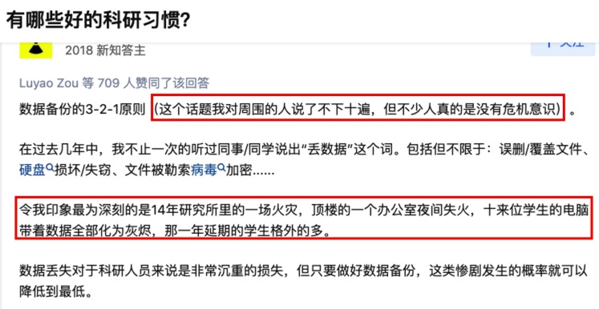{width="0.8\\columnwidth"}

这些情况，单个可能很罕见，但所有可能性加起来，再乘以3到4年时间，至少发生一次的概率并不小。如果发生，你的博士进度会被耽误多久，你的青春又会被耽误多久呢。

只有一份的数据是非常脆弱的。现在思考一下，你赖以生存的电脑、数据、论文，是否只存了一份？如果是，请立即把屁股从椅子上挪起来，去厕所洗把脸，问问自己都是成年人了，怎么心这么大，然后开始看下面的攻略。

### 理论：321原则

「3-2-1 原则」是商业公司通用的数据备份金方法，具体内容是：

-   3：存储 3 份完整文件，一份原件加上两份拷贝。

-   2：将文件起码保持在两种不同的介质上。

-   1：将一份拷贝保存在异地。

所谓的「介质」，是指内置硬盘、移动硬盘、U盘、网盘等不同的存储介质。说起来好像很麻烦，但对我们来说最简单的实践是：原件保存在内置硬盘，将两份拷贝分别存到移动硬盘和网盘，就同时达成了三条要求。这时，你回过头去看一下我上面列举的所有可能的灾难性问题（甚至即使是网盘公司突然倒闭），都能做到游刃有余，不影响你的科研！

### 实践

到动手准备的环节了。首先根据你手里的资源，决定你要备份的范围。最土豪的情况，你可以把整个电脑做一个本地备份 +
云端网盘备份，但很多时候，要么网盘容量很小，要么移动硬盘容量不够，要么网速太慢把太多资料传网上很慢，所以先划定你的备份范围。

-   最经济的方案：只备份最重要的文件。例如：论文、科研资料、CV、电脑桌面，等等。网盘实时备份+移动硬盘定期备份。对移动硬盘和网盘容量要求都很小。

-   最高效的方案：整个电脑（包括最重要的数据）本地备份；最重要的科研、论文等加一分网盘实时备份。这需要一块比你电脑硬盘更大的移动硬盘（不贵），加正常容量（10个G左右）的网盘。

-   ~~最土豪的方案：买个NAS，插几十T的盘，组RAID1，再实时传一份到异地。~~

正常电脑硬盘容量一般在2T内，另外我假设大家去买一块2T以上的移动硬盘（500块以内）应该压力不大（导师经费较多的，可以直接问导师要，直接说想要一块移动硬盘做备份问导师能不能帮忙买就行，2000块以内报销都很简单）。所以下面只介绍中间的高效的方法

#### 电脑整机备份 {#sec.pc_backup}

把电脑整机备份的一大好处就是，假设电脑直接灭失，新买一台电脑过后，能在一天之内完全恢复之前的工作状态，无缝衔接，科研毫不受影响。

Windows和macOS都自带系统级的整机备份方案。网上攻略特别多，我就不废话了。

-   Win请在b站直接搜索windows备份看教程，一般使用系统的"备份与还原(windows7)"（虽然名字里有win7但win10和win11也是完全能用的，这也就是为什么一直没被扔掉），比如看这个视频
    <https://www.bilibili.com/video/BV1Dy4y1x7RP>

-   macOS请在b站直接搜索mac time machine，一般使用系统设置里的"Time
    Machine"，比如看这个视频
    <https://www.bilibili.com/video/BV1oy4y177qS>

一个视频看了不太明白没关系，多搜几个看，也同时善用谷歌、知乎等。初学者可能感觉学习成本有点高，但不要等到电脑炸了再开始准备呀。

#### 网盘备份 {#sec.net_drive_backup}

Box（<https://box.xjtlu.edu.cn/>）是学校的自建网盘，2022年升级到了每人100G的免费空间，内网上传下载速度可达千兆，同时自带3个月的文件历史版本，秒杀一众网盘。把重要的文件夹拖入seafile客户端（不用移动文件夹），他就会自动实时备份到学校网盘。使用方法见
<https://guide.xjtlu.edu.cn/box/student/drive_client/drive_clent_for_windows.html>
。Box唯一的问题是不支持链接分享文件（老师有分享权限，我们没有），但作为备份网盘非常合适。

另外，如果对学校IT不放心，可以同时安装一个另外的商业网盘进行第二重网盘备份。个人严重不推荐百度云，因为偶尔会随机吃文件。国内的，我个人推荐坚果云（免费版无限空间，但限制每月流量），国外网盘推荐Onedrive（个人版免费5G，可在淘宝搜索onedrive扩容花几块钱扩容到永久15G）。另外，大家的利物浦账号下都有免费1T的Onedrive，羊毛薅起来（但注意毕业前得把数据迁出去，因为毕业了要收回账号），参见这一章节
[4.5](#sec.fuli_liverpool){reference-type="ref"
reference="sec.fuli_liverpool"}。

### 论文备份·文件历史版本

上述备份防灾的方法可以应对绝大多数数据丢失的场景。但，各位的论文，包括毕业论文和期刊发表的论文，作为最重要也是最脆弱的资料，除了怕丢失还特别怕这两件灭顶之灾：

1.  版本混乱。论文从一开始写到写完，中间修改个几十版是常事。特别是在临近提交的时候，一定会由于导师意见、二导意见、合作者意见等再battle个十几版出来。其中各版本的区别可能非常小，肉眼也很难分辨。一定会有一天，你也搞不清楚哪个是哪个版本、忘了在哪个版本作了什么修改，会在分辨版本上反复花费时间，进而导致
    ↓

2.  文件覆盖，例如(1)新版本直接覆盖了老版本，但过一段时间又因为某种原因要拿回老版本
    (2)老版本覆盖了新版本，几个月的论文白改

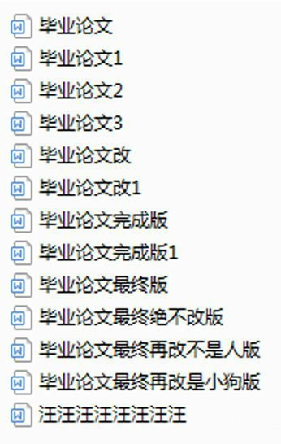{width="0.95\\columnwidth"}

读到这里，你如果感兴趣可以做个实验，创建一个文件，里面写上一些内容。然后在其他文件夹新建一个同名文件，写上另一些内容。最后，把它拖过来，覆盖掉前面的文件，这时，试一试自己有没有任何办法找回前面文件的内容。

你可能要问，上面不是说了这么多备份方法吗？是的，这些备份方法主要的作用是防丢失，比如电脑丢失、硬盘损坏，但少有备份能做到防覆盖。比如，实时备份的网盘，你本地把文件错误覆盖了，云端也马上被覆盖了。本地备份硬盘，如果备份频率不高，则还有一线生机，但如果过一段时间再去找，也可能找不到了。

因此，为了你的论文（命根子）安全，完全值得再加一层保险：

1.  Windows开启系统级的文件历史保护：<https://www.asus.com.cn/support/FAQ/1013067/>，别忘了一定要把你的论文文件夹添加进去才能生效

2.  mac的TimeMachine（时间机器）备份自带了文件历史功能。参照前面的
    [6.1.2.1](#sec.pc_backup){reference-type="ref"
    reference="sec.pc_backup"}
    配置好TM，整个电脑的文件历史就都包括在备份里了。

3.  Linux用户，我相信你们有的是办法。最笨的办法，直接写一个shell脚本，把论文文件夹直接复制到其他目录、用日期命名，最后把这个脚本加到crontab里定期运行即可。

4.  以上是开启本地文件历史的方法。一些网盘自带文件版本功能，但一般限制版本数量或者日期，或者必须要买会员才能开启文件版本。开启过后，相当于云端也存了一份版本历史，万一本地的你没设置好或者其他什么原因不能用，还能在错误覆盖的时候救你一命。学校的seadrive自带大概两个月的文件版本，免费，非常良心，再次建议大家使用。直接把文件夹拖进去备份，就会自动产生文件版本。参见章节
    [6.1.2.2](#sec.net_drive_backup){reference-type="ref"
    reference="sec.net_drive_backup"} 。

5.  会一点Git、GitHub的同学，请直接把整个论文文件夹创建成Git项目，并上传到GitHub做成private
    repo，每天工作结束后交一个commit来备份版本，同时记录你修改了什么内容。对于论文，Git是最完美的备份方案，可以轻松回滚到老版本同时从不担心覆盖、甚至能轻松知道哪个地方的修改是在什么时候引入的，比以上所有方法都靠谱。Overleaf也有GitHub集成，可以方便的与导师协作。但Git学习成本略高，不过网上有无数详尽的教程，感兴趣、学有余力的同学可自行学习。

::: flushright
(2022年12月02日 by )

(major update: 2022年12月30日 by )
:::

## 远程控制·如何校外访问校内电脑

人在校外的时候，经常会很想念校内的电脑。不管是学校给大家每人配的小台式，还是用导师经费买的的其他电脑，都可以远程控制。

### 学校配的电脑·准备工作

（如果不是想访问学校配的电脑请直接跳到下一节）

学校给的电脑比较特殊，默认我们不能安装软件。有两种办法

1.  发邮件或者打电话给IT，直接问他们要管理员权限。就说你是博士生，要在学校给的电脑上装软件。之后就可以装控制软件了

2.  上面这种办法过后，电脑还是归学校管理，仍然有一些限制，但对普通使用基本够了。~~（有强迫症）~~想完全控制学校电脑的同学~~（比如我）~~，可以直接格盘重装系统，或者分区（保留原系统）另装系统做双系统。windows重装系统、分区做双系统的教程，b站和知乎特别多。

### 桌面控制软件推荐

以下软件不分系统，win/linux/mac均可用。

-   VNC: 被控端（学校电脑）安装 VNC Server
    <https://www.realvnc.com/en/connect/download/vnc/>，控制端（你手上的电脑）安装
    VNC Viewer
    <https://www.realvnc.com/en/connect/download/viewer/>，注册账号登录使用，无需记录连接码。推荐理由：VNC是饱经检验的远程桌面，只要网络不挂，一般不会有问题。

-   ToDesk：<https://www.todesk.com/>两边电脑软件一样。推荐理由：新兴软件，流畅度一般比vnc好一些。

-   其他：anydesk，Teamviewer，向日葵，均可尝试。其中，不太推荐Teamviewer，虽然老牌，但因为很可能检测到西浦的网络环境过后强制购买商业版，其他软件无此问题。

### 远程SSH

（不用linux的同学可直接跳到下一节看踩坑）

如果被控端是linux，你又主要使用命令行操作，那在桌面控制外，直接设法连接SSH，速度会快特别多。

电脑在学校是10开头的内网ip，如何在外面SSH？这种奇技淫巧叫做【内网穿透】

首先推荐这个视频：

[【硬核】公网访问？内网穿透！零经验上手！](https://www.bilibili.com/video/BV1Qq4y1w7F5)<https://www.bilibili.com/video/BV1Qq4y1w7F5>

视频里校内机器可用的方案有两个，分别是

-   视频的04:52，用IPV6连接。但要注意，我实测学校IPV6不稳定，过几天就会出现有v6地址但不能上v6网站的情况，更别提访问。即使你能做ddns，我个人也不推荐。

-   更靠谱的是视频08:09介绍的大内网穿透。免费易用的方案有：Zerotier（在境外，略慢），花生壳（国内老牌，但注册需要身份证），NOFRP（新兴，可靠性可能不高），或者直接在b站搜【免费内网穿透】，会有很多新方案。这几个方案如果不太会，b站、知乎有大量教程。

-   （进阶大流量版，但学习成本较高）免费的方案对流量和带宽的限制都比较大，只是SSH执行命令完全足够了。但如果你想要奢侈的用scp拷文件，或者用SSH转发VNC，请考虑用导师的钱租一台云服务器，手动搭建frp服务（比较麻烦，但操作完过后用起来很爽，转发VNC比前面几种远程桌面都快），甚至，在宿舍宽带下弄个垃圾机器做跳板机，搞到公网ip，配合ddns，无限流量访问。这些方案学习成本较高，有兴趣的可以参考网上教程慢慢折腾。

### 踩过的坑

下面是我踩过大量坑过后从坑里带出来的经验：

1.  冗余提高可靠性：不要只用一个远程控制方案，万一挂了一个，还能用另一个。请至少安装两个，如果是长时间不在校，可以安装更多个。我自己用的是：家宽里用一台二手瘦主机搭frp加ddns +
    花生壳作backup-plan + vnc作another-backup-plan +
    ToDesk四重备份方案，稳定访问校内的linux电脑。

2.  安装完成后，重启一次，看下控制软件是否能自己启动。

3.  如果被控端是windows电脑，请务必屏蔽系统更新。虽然重启没问题，但windows大版本更新过后，会卡在一个让你同意新的用户协议的界面，除非你到场点一下，所有软件都不会启动，也就直接失去控制。请百度【禁止windows更新】。个人建议用组策略+改host组合拳。

4.  跑程序的同学，请务必注意，不要超内存，不要炸系统内存。内存一吃满，系统立即死机，控制软件全杀完，而且还不会自己重启，必须要到场强制重启。请一定想办法在程序里监测、控制内存用量。

5.  有条件的可以购买【向日葵控控】这样的远程KVM硬件，即使死机也可以自己远程强制重启。

6.  再好的方案，也敌不过学校网络维护断网和学校施工断电。而这些，也是可以防御的。应对断网，请注意在网络登录时勾选macauth，网络维护完了就又能用了。来电自动启动功能，需要主板支持，在主板说明书搜索boot
    on power或boot with
    power，或直接搜power，看看有没有。或者，购买向日葵控控。不过断电断网始终是极少数时候，除非你一走几个月，基本不需要考虑~~（但万一呢）~~。

7.  请和至少一个在校同学搞好关系，新手总会遇到各种意外的情况失去控制，需要办公室同学帮你跑腿看机器情况。100种远程控制的方案背后，也需要好同学做物理控制。万一的万一，哪天网线被人不小心踢掉了呢，还是只有~~通过py交易~~让同学帮你弄。

::: flushright
(2022年11月09日 by )
:::

## 我的老腰受不了了------如何保持颈椎、腰椎健康

### 缓解腰的问题：升降桌

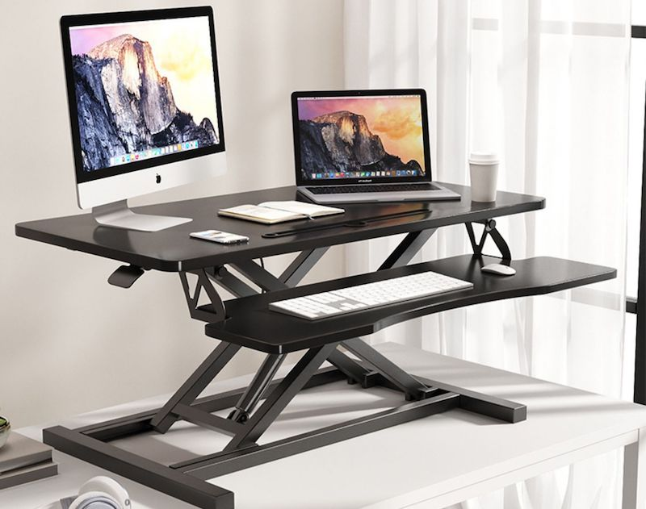{width="0.95\\columnwidth"}

在没有读博之前，我就患上了严重的腰肌劳损。这个玩意怎么说呢，说是大病吧，他不是，但无时无刻不在折磨着你。最严重的时候，疼的我晚上都睡不着。去医院看过也开过药，但医生说这个病需要自己保养，无法根治。后来我试着跑了半年步，哎！腰肌劳损神奇的好了，现在一点都不疼了（如遇久坐，仍旧是不行的，会疼）。读博之后也没有心情运动了，于是买了一个升降工作台（推荐人手一个！太好用了！）。可以站着办公，站累了就坐下办公。极大程度上杜绝了久坐对腰椎的伤害。

::: flushright
(2022年12月30日 by )
:::

### 来自重度腰椎间盘突出、颈椎病患者的深度建议

#### 升降桌：可极大缓解腰椎问题，但不能完全解决

我十年腰椎间盘突出加五年颈椎病，19年的时候腰就疼到没法坐一整天，就在实验室放了台升降桌，站着用了三年电脑。今年还在卧室里放了同款升降桌。但长期站着和坐着一样对腰不好，最后会变成站着和坐着一样会腰疼。升降桌不是长久之计，站着只是换了角度继续损耗腰椎。

不能完全依赖升降桌：这几年太依赖升降桌，导致现在长时间站着和坐着一样腰疼，去拍核磁医生都问我是不是腰骨折了。如果真的想缓解腰疼，就要避免久坐久站。中学教师容易得腰疼一方面就是因为站着讲课时间长了。

总之升降桌可以用，但不能长期用它代替坐着用电脑。可以交替用，平时再多锻炼就行。

注意事项：升降桌记得没事调一调高度。我放实验室里的升降桌几年没调好像液压杆生锈了，都调不动了，直接变成了一般桌子。

#### 外接屏：避免和缓解颈椎病

颈椎病难受的一点就是，低头时间长就脖子疼，出门在地铁高铁上我都不得不把手机竖起来抬高和眼平行，不然用不了太长时间。

我再贡献一个避免和缓解颈椎病的方法，就是不要长时间用笔记本电脑，长时间低头看屏幕会演变成颈椎病。低头看手机也是。

如果常用笔记本电脑就要在卧室和办公室都放一个台式机屏幕当外接屏。

我颈椎病就是高强度用了一年笔记本电脑得上的，后来只用外接屏就不再继续加重了。

如果经常高强度用笔记本电脑，不用外接屏的话和整天低头用手机一样都是颈椎杀手。我在实验室看见有人长时间用笔记本都会劝他们用外接屏。

笔记本支架也可以，比显示器便宜。但如果视力不好，还是尽量外接屏，因为笔记本屏幕太小了，费眼。我以前也买了很多笔记本支架，现在都用来放显示器了，笔记本刚好能放在下面很方便。

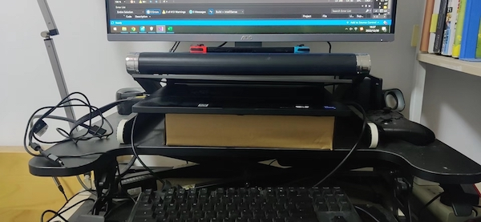{width="0.95\\columnwidth"}

#### 最好的解决方案：改变生活习惯、加强锻炼

建议有腰椎间盘突出和颈椎病的人还是多锻炼。但不要盲目去健身房锻炼，最好的锻炼方法还是游泳，因为其他锻炼方式大多会需要腰部用力，加重腰疼。

我目前只是偶尔腰疼到不能弯腰。我还认识腰疼到走路一瘸一拐的，他也是慢慢锻炼才逐渐好转。

如果自制力不强，加学校游泳社团也行，起码有人经常一起去锻炼能有动力。

办卡的话，我记得每年九月份独墅湖游泳馆能办半价年卡，但学校社团很便宜，更划算。以前我办游泳卡前每周都跟着学校游泳社团去游一两次，办了年卡后，一年去了不到五次，后来就去得更少了。
如果自制力可以，每天锻炼是最好的方法。
如果坚持不下去，还无法改变生活习惯，就会越来越严重。

最后，如果腰疼比较严重，有空可以去医院骨科看看，做一下核磁，看一下腰椎到底发展到哪个地步，来决定怎么具体该恢复。现在腰疼在年轻人里很普及。

::: flushright
(2022年12月30日 by Jialin Wang)
:::

## 利物浦访学 {#section.UoL_visit}

### 交流时长

一般是3-6个月，短于3个月也行，原则上来说不允许超过6个月，如有超过六个月的，需要写明充足的理由，并获得两方导师以及
HoD
的批准。不过，利物浦那边学院的行政告诉我他们没有预算给超过六个月的部分，这个可能会是一个问题；另外，超过六个月的访学时间可能会涉及签证问题，需要提前咨询。

### 关于 host supervisor

如果导师团队中有利物浦导师，那默认就是那个老师。如果没有但又特别想去利物浦，可以自行联系利物浦那边的意向老师，要获得他/她的许可和签字。

尽管大多数同学的导师团队中会有一个来自利物浦的导师，但每个项目可能都不一样，也许你在去利物浦之前和他的互动并不频繁。这种不频繁可能是不同原因带来的，不一定是因为你工作的领域和他不同。所以如果你认为在利物浦与他合作会很有趣，那么请提前做些准备。

如果你之前和 ta
没什么互动，请务必通过某种方式建立一定程度上的熟悉感，这会使后面的合作更加顺畅。这可以是通过视频会议或邮件分享你的研究进展及计划、一起合作撰写
paper、或提前构思潜在的合作研究内容等。

我们知道团队合作有可能出于不同的原因（详见
[5.1.5](#subsection.teamwork){reference-type="ref"
reference="subsection.teamwork"}），但无论如何，请务必提前与你在利物浦的导师至少在大方向上确认你访问期间的活动，包括但不限于：需要他参与的事情、时间安排、需要你准备的事情、以及你准备做的事情。

### 关于 funding

西浦：学校提供1万2的经费，包含苏州往返上海办理签证的高铁票，签证费用，来回英国机票，英国当地往返利物浦的火车票（比如你落地曼城，坐火车去利物浦，就报销那一趟车票钱！以及回国时从利物浦前往机场的火车票or大巴车票），由于登机所必要的住宿。除了这些，其他的一概不报销！！而且总额不超过1.2w，超出的部分学校一概不负责。

利物浦：提供免费住宿（包bills，水电燃气随便用）+每周100磅的生活费

### 签证流程

-   去官网填写相应信息

-   信息填写完毕后会让你选择递签地点和日期

-   会跳转到一个网站让你选择额外服务(比如加急或者快递)，务必记住自己的申请号(GWF+一串数字)

-   准备相应材料，具体需要什么材料可以查看check
    list。所有材料均为英文。需加盖翻译公章或邀请你身边有专八证书的为你的翻译件签字\
    \
    护照是必备的，其他的材料包括但不限于:

    -   银行流水/存款证明--我交的是存款证明，因为我在信息填写中写了存款金额，而且据说存款证明信息比较少，会加速审核流程。此处也可以递交固定资产证明。

    -   结婚证(如果是已婚)

    -   学校开的在读证明和资金支持(因为我是学生)，已工作的人可以交工作证明

-   递签--递签当日提前半小时到达签证中心即可。进去后会有工作人员引导你排队，然后进入里面将check
    list给工作人员，她会给你一个号码，等叫号。第一次叫号是初步询问，会问你要不要快递或短信或加急服务(短信服务可不要，因为邮箱第一时间也会有通知)。如果step
    3未选择任何服务但这时要购买会给你开个单子然后让你去交钱。快递服务购买后会给你一个快递面单让你填写收件信息(EMS，填写中文即可)。接着再次排队等着进小房间。小房间里需要把护照交给工作人员+录指纹+拍照

-   递签当天邮箱就通知签证申请被发送去审核了

-   收到签证返回的邮件，快递打电话通知取签证。PS:
    如果离签证中心有一定距离或者不想排队领签证的话，推荐快递服务

### 衣食住行

[Halls Life](https://hallslife.liverpool.ac.uk) 是利物浦大学学生宿舍的
community
hub，提供了对衣食住行的若干建议，强烈建议在出发前往英国之前浏览，可帮助决定是否携带某些行李。

#### 赴英物品（供秋冬季去的那批参考）

-   转接头\*2，插排\*1

-   小锅\*1，碗\*2，筷子\*2

-   保温杯，烧水杯

-   冲锋衣，长款羽绒服，羊绒衫，围巾\*1，帽子\*1（利物浦保命必备！），防水运动鞋

-   塑料拖鞋（这玩意那也有，就是价格有点小贵）

-   贴身衣物若干，秋衣秋裤\*2（真滴有必要！），睡衣\*2（那边也有，质量一般呐）

-   小方巾\*2，干发毛巾\*1

-   折叠衣架

-   牙刷，牙膏

-   洗衣皂，洗衣袋

-   耳机（无线耳机必备，经常去办公室或者图书馆的可以再备个头戴式的）

-   眼药水

-   现金（50磅足矣，基本用不上）

-   结实的雨伞（必备！）

-   床单，枕套，被套，被子，枕头（床上用品也可以落地再买，由于本人没什么行李且认枕头，所以就自带了）

电话卡的选项很多。办签证的时候可以顺手领一张cmlink，但注意诈骗！！激活后就会有乱七八糟的诈骗电话，啥也别理就对了。落地英国后可以去办EE，Vodafone，O2等电话卡，有的公司会提供如免费咖啡券等福利。

#### 交通

trip.com （携程海外版）可订全英火车、地铁、飞机、酒店。
或者这边常用的单独 app 也很多：trainline 订火车票；skyscanner
买飞机票；booking 订酒店；Uber 打车。

如果有经常坐火车的需求，可以考虑办个 railcard，每张火车票可以省 1/3
的钱。

#### 住宿

抵达利物浦前两星期会有邮件通知，利物浦会统一安排，每批学生住宿的地点不一样，所以离学校的远近也就无法确定。但几个宿舍区离学校都不算远，步行20分钟左右能到。无法自主选定一起住的同学，耐心等待安排即可。但如果临近入住时间还没有收到邮件（发生过），可以主动联系利物浦的学生宿舍部门
<hallsres@liverpool.ac.uk> 询问。

#### 办公室和ID卡

到达之后相应的staff会告知你办公室所在位置，自行前往即可。办公室有显示器和主机。

带上护照去IT那边可以改campus
code和办理学生卡。ID卡可用于进出办公室，图书馆，打印，借书。

#### 利物浦好吃的

-   张记

-   美味轩

-   老蜀人

-   ejoy里面的煎饼

-   泰熙家（韩餐）

-   turtle bay（加勒比菜）

-   Cowshed（牛排好吃！）

-   Bamboo（白人饭，氛围感店，适合拍照打卡）

-   Hardware （brunch，下午茶都不错！）

-   Johnny炸鱼薯条 （浅尝一下就行，一般，很油腻）

-   Zizzi - Liverpool One（意大利餐）

-   Haute Dolci Liverpool（环境好，好吃好拍）

-   chaiiwala（一定要试试印度奶茶）

-   sweet time bakery(想吃中式面包就买它)

-   TSUJIRI Matcha House （抹茶党狂喜）

-   贡茶（每每emo就奖励自己一杯黑糖啵啵奶盖！）

#### 访问其他学校图书馆

当你在英国四处游学访问，如果恰好在疲惫时经过一所大学的图书馆，你其实可以进去坐坐，只要你提前申请了
[SCONUL Access](https://access.sconul.ac.uk/sconul-access)。

虽然不同图书馆政策不同，但大多数情况下你至少可以在成功申请后进入图书馆，有的图书馆还会提供计算机访问或图书借阅等权限。

> Q. Do I need to complete an online application for each institution I
> would like to visit?
>
> A. No, although you do need to indicate a library you are interested
> in visiting as part of your application, your approval email allows
> you to visit any of those libraries on the list. You do not need to
> reapply. Oct, 2024 from [Access FAQ \|
> SCONUL](https://access.sconul.ac.uk/page/access-faq#Multiple%20applications)

申请提交后会由利物浦大学图书馆处理，批准后就可以凭邮件去各大学图书馆前台办理访问卡啦～

::: flushright
2022年10月21日 by\
major update 2025年3月6日 by ：补充 funding、签证、衣食住行等内容
:::

## 西浦虚拟机

<https://vdi.xjtlu.edu.cn/portal/webclient/index.html>
如果在学校外面，想临时快速访问学校内的资源、软件，可以使用学校的在线虚拟机。虚拟机相当于放在校内的一台电脑

## 图书馆的文献数据库

连接校园网后，绝大部分学校订阅了的期刊论文都可以直接在论文页面下载，但(1)有的期刊官网不能识别你的IP，甚至例如著名的Annual
Review系列 (2)如果你在校外也想下论文，这时就可以用到图书馆的论文数据库

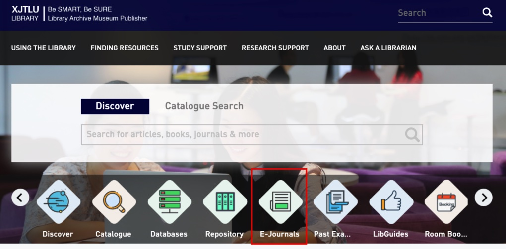{width="0.7\\columnwidth"}

我用得最多的是在首页 <https://lib.xjtlu.edu.cn>
点击e-journal，按期刊名称搜索期刊，然后就可以跳转专有链接访问。同时，图书馆还提供了很多全文数据库，甚至还有知网等中文期刊数据库。详细的使用姿势，见图书馆往期培训
<https://core.xjtlu.edu.cn/course/view.php?id=905>
，或者直接本项目的GitHub里（[链接](https://github.com/kaiwu-astro/xp_pgrs_unofficial_guide/tree/main/fileshare)）找到PPT。

## 苏州图书馆借书和免费送书

想看独墅湖图书馆的书，想借苏州图书馆的书，但是太远了不想去怎么办？直接小程序借书！苏州图书馆的书可以**【免费】**送到独墅湖图书馆取书，而独墅湖图书馆的书可以直接送到学校图书馆门口。
微信搜索【苏图借书】小程序。因为医保卡就是市民卡可以直接拿去借书，如果你已经拿到了医保卡，可以直接绑定医保卡，免开卡费。然后在小程序内按提示操作即可。

## 重视自己的负面情绪和抑郁倾向 {#sec.mental_health}

<figure>

<embed src="author-folder/Kai.Wu/mental_1.pdf" /> <embed
src="author-folder/Kai.Wu/mental_2.pdf" /> <embed
src="author-folder/Kai.Wu/mental_3.pdf" />

</figure>

伯克利研究生会2014年发表的[研究生幸福和健康报告\[链接\]](http://ga.berkeley.edu/wellbeingreport)显示，46%的博士生存在心理健康问题。Nature等权威杂志发表的研究认为，

1.  研究生患严重焦虑和抑郁症的比例是普通人的6倍
    [\[文献链接\]](https://www.nature.com/articles/nbt.4089)

2.  更聪明的人更有可能患情绪障碍，如焦虑或抑郁，但不太可能寻求帮助
    [\[文献链接\]](https://www.nature.com/articles/nj7677-549a)

3.  情绪障碍在自杀中占80-90％
    [\[文献链接\]](https://www.sciencedirect.com/science/article/pii/S0160289616303324)

4.  新冠大流行期间，每5位研究者中就有4位表现出收精神健康困扰的迹象
    [\[文献链接\]](https://www.tandfonline.com/doi/full/10.1080/21568235.2021.1992293)

<figure>
<table>
<tbody>
<tr class="odd">
<td style="text-align: right;"></td>
<td style="text-align: center;">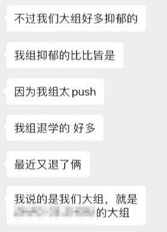</td>
<td style="text-align: left;">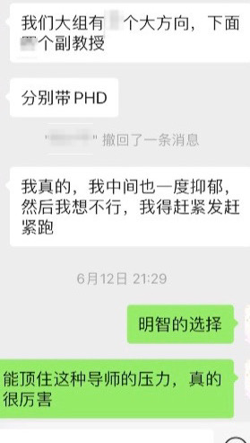</td>
</tr>
</tbody>
</table>
<figcaption>和一个已毕业的同学聊天的记录。抑郁在我们学校博士生的发生率也比想象高得多</figcaption>
</figure>

作为高危人群的我们，接受了大量专业知识技能的训练，却几乎从没有人教我们「如何保持精神健康」。如果你现在经常感受到紧张、焦虑、失望，甚至因此有失眠等症状，请立即正视你自己的情况，把你的健康放到第一位，同时feel
free to寻求学校心理咨询室的帮助。

同时，事前预防永远比事后治疗有效。希望读到这里的同学，不管你现在是否感觉良好，都点击下面的链接，读一读Zoe
Ayres在利物浦的演讲（就是上面几张PPT的出处）和她的《*Managing Your
Mental Health During Your PhD - A Survival
Guide*》一书，健康度过研究生生涯。  [\[GitHub链接\]](https://github.com/kaiwu-astro/xp_pgrs_unofficial_guide/tree/main/fileshare)     [\[不能上GitHub的用这个链接\]](https://gitee.com/kaiwu-astro/xp_pgrs_unofficial_guide/tree/main/fileshare)

## 大家电脑上都装了什么软件？（期待你的补充）

：我来抛砖引玉说一些我一定会推荐同门师弟尝试的软件：

{width="\\columnwidth"}

-   科研和生产力工具

    1.  Notion
        （全平台）。无比强大的新一代笔记软件。我本来是Onenote重度用户，用Onenote记了7年笔记过后偶然被介绍了Notion，在尝试了很短时间过后就决定放弃用顺手的Onenote，完全转投Notion。推荐理由：Win/Mac/Linux/网页/iOS/Android全平台支持；强大的数据库功能，可完美构建自己的GTD系统，大幅提高效率；快速的全局搜索；现代化的协作功能，甚至可以用来做团队管理和Project
        management；强大的分享功能，可以轻易把笔记分享成公网网页；b站有大量教程。

        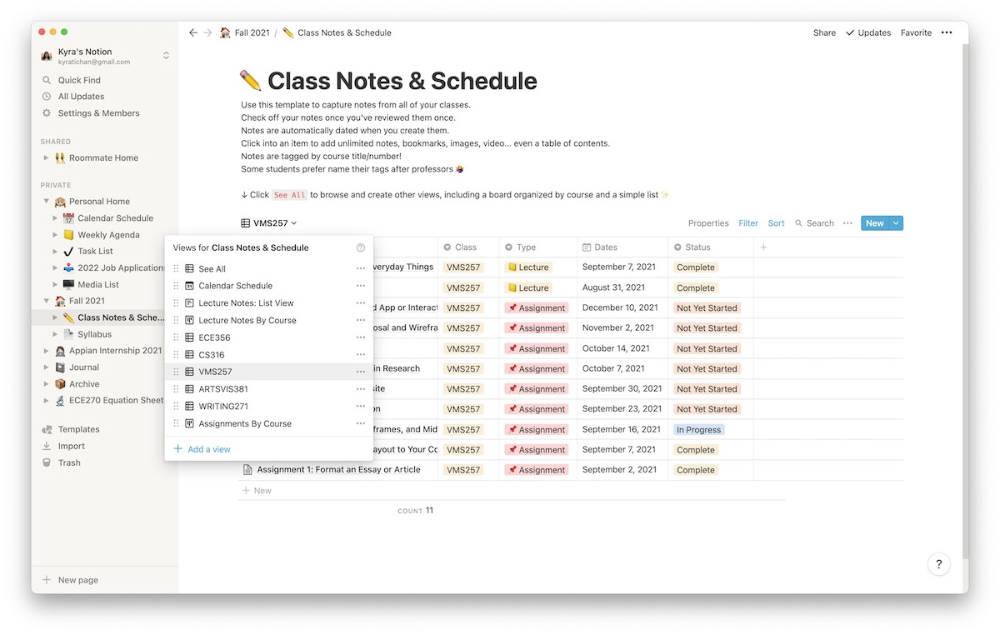{width="0.8\\columnwidth"}

    2.  滴答清单
        （全平台）。我用过很长时间的Wunderlist（后被微软收购变成Microsoft
        to-do）、iOS自带的提醒事项和其他好几种清单软件，只有滴答清单用起来最顺手、最符合直觉。搭配Notion使用，可以方便的管理好学习、生活的所有大小事。支持全平台。

        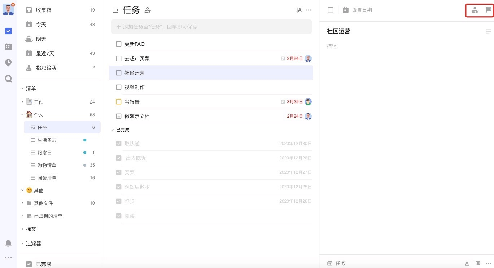{width="0.8\\columnwidth"}

    3.  Trello
        (全平台）。卡片式管理你的待办事项和任务。我导师一直严重依赖Trello来把他的暴多事情管理得井井有条。虽然我认为Notion是Trello的子集，但如果你因为某些原因不喜欢Notion，至少可以尝试下Trello。全平台即可下载。

        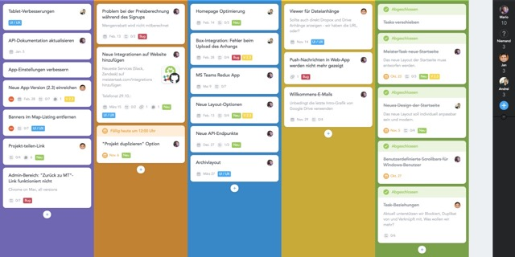{width="0.8\\columnwidth"}

    4.  VSCode (Visual Studio Code)
        （PC全平台），2019年左右兴起的开源文本编辑器，有极其强大的社区和插件支持。目前我的期刊论文、毕业论文、包括现在你看到的这一本攻略我都是用VSCode +
        LaTeX
        Workshop插件写的。我的所有数值模拟程序、数据分析脚本也都是用VSCode完成。缺点是有较小的上手难度，需要折腾配置；以及和Chrome一样占内存。

        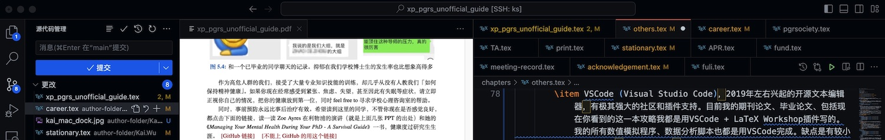{width="0.8\\columnwidth"}

    5.  Spark。苹果多年的最佳App开发者Readdle做的邮件app，一站式管理所有邮箱，能把邮箱配置同步到云端，解决了每买一个新设备就要重新添加一大堆邮箱的问题。似乎是Mac和iOS独占，不确定其他平台有没有。

        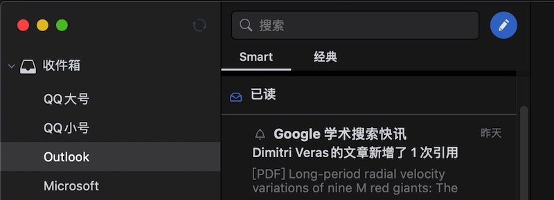{width="0.8\\columnwidth"}

    6.  文献管理软件就不推荐了，萝卜青菜各有所爱，没有的赶紧去问师兄师姐或者上b站看推荐。

-   效率工具

    1.  Bob（MacOS）或Pot（Win/Mac/Linux），划词翻译、截图翻译、OCR工具。支持接入ChatGPT、DeepL、谷歌翻译、有道翻译等各种翻译接口，甚至可以做到一次调用就同时输出多个平台的翻译结果然后对比。Bob在Mac的App
        Store下载；Pot在pot-app.com

        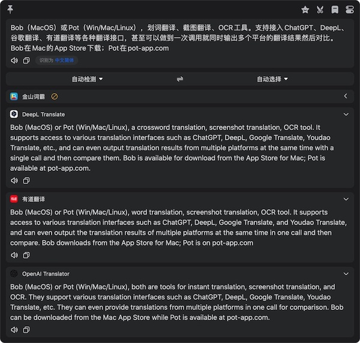{width="0.8\\columnwidth"}

你有发现什么很好用的软件吗，希望不吝赐教分享给学弟学妹

你的推荐：

# 避坑指南（待补）

## 一个坑

如果你踩过什么坑，可以花两分钟告诉我，标记在这里，免得大家一起踩坑，~~形成喜闻乐见的场面~~

# 写作指南 {#chapter.author-ins}

你用十几分钟写下的经验，可能会节约下后来人几小时甚至几天的时间。欢迎为本攻略做出贡献。

最简单粗暴的贡献方式，直接把纯文本、word或者tex文件发给
。管理员会帮你把文件转换成LaTeX格式放进攻略。虽然管理员可能没有那么开心，因为要费些时间建文件整理上传，但也是可以的。如果你心疼可怜的管理员，可以看看下面的方法（嫌麻烦的同学可以跳过下面的部分，直接看本页最后一段话）。更好的投稿姿势：

-   如果你有使用Git和交Pull
    Request的经验，也会写LaTeX，那么可以直接在[本手册的GitHub页面](https://github.com/xp-pgrs-unofficial-guide/xp_pgrs_unofficial_guide)提交PR。[如何交PR可参照这个链接](https://www.zhihu.com/question/21682976/answer/79489643)

注意：对于上面高级的投稿方法，为避免多人协作弄乱顺序，请每位作者在`author-folder`文件夹下建立自己的子目录，在里面新建`tex`文件写作，第一行直接从`section`命令开始，其后写正文。写完了过后，在正确的章节里，用以下代码把你的稿件插入到`chapter`文件夹下的章节里

        \input{你的tex文件路径}

例如，王多鱼同学想要分享自己的常用软件。首先在`author-folder`下建立一个`duoyu.wang`文件夹，在里面新建`health-insurance-use.tex`，第一行写`\section{学生医保使用}`写标题，后面写正文。写好过后，在`chapters`文件夹里的`others.tex`中，添加一行`\input{author-folder/duoyu.wang/health-insurance-use.tex}`，就完成了。

如果要一些高级的编辑方式，可参照项目 GitHub
的`author-guide`目录下的模板手册和例子。

属不署名都可以。可以匿名，也可以把姓名邮箱院系入学年份都写上。你如果愿意的话把生辰八字、出生年月、房产车产详情附上也是完全可以的，这样甚至可以问问PGR
Society能不能安排相亲（雾）。最后必须要提醒：您不得发布任何违反中华人民共和国法律、西交利物浦大学博士生守则、[利物浦大学博士生守则](https://www.liverpool.ac.uk/aqsd/academic-codes-of-practice/pgr-code-of-practice/)和其他任何适用规定的内容。您需要对你发布的内容负责，PGR
Society无法对内容的准确性做担保或审核。由您发布的内容导致的任何纠纷，PGR
Society社团和其他作者不承担任何连带责任。

再次感谢你为学弟学妹们、祖国的花朵们做出的贡献 (ง •̀\_•́)ง

# 附录 {#sec.appendix}

## 校园地图

{width="\\columnwidth"}

## 学校电话

  部门                                              电话                    邮箱
  ------------------------------------------- ---------------- -------------------------------
  Academic Services Office 学术服务              8188 4754            aso@xjtlu.edu.cn
  Alumni Service 校友服务                        8816 1869           alumni@xjtlu.edu.cn
  Campus Management Office校园管理办公室         8816 1071            cmo@xjtlu.edu.cn
  Career Service 就业服务                        8188 8308          careers@xjtlu.edu.cn
  IT Service Centre IT服务中心                   8816 1250             it@xjtlu.edu.cn
  Library 图书馆                                 8816 1290       askalibrarian@xjtlu.edu.cn
  Media Service 新闻线索与媒体服务             8816 1351/1032         news@xjtlu.edu.cn
  Postgraduate Recruitment 研究生招生          8816 1889/7111     pgenquiries@xjtlu.edu.cn
  President's Office 校长办公室                  8816 1004      president.office@xjtlu.edu.cn
  Registry 教务办公室                            8816 1230          registry@xjtlu.edu.cn
  Research Management Office 科研管理办公室      8816 1139     
  Student Onestop Centre 学生一站式              8816 1854          onestop@xjtlu.edu.cn
  XJTLU Global (Support) 西浦国际              8897 3094/3093        global@xjtlu.edu.cn

## 加入我们：评论机制及委员会化运作动议

**摘要：**
*本攻略已经覆盖了西浦博士生从入学到毕业的多类重要信息和经验，已经事实上成为唯一的从西浦博士生视角出发的成体系攻略。但是，攻略也有可持续性的问题，为此我们提出了包括设置评论机制、组织
workshop、扩充供稿渠道、寻求运营经费、设置运营委员会等在内的调整动议。我们热切欢迎任何愿意参与的同学及一切可能的帮助。*

可喜可贺，历时两年半，我们的《西浦博士生非官方攻略》已经有了六个正文章节!除原有的[中文版](https://github.com/xp-pgrs-unofficial-guide/xp_pgrs_unofficial_guide/releases)之外，我们也在推进[英文版](https://github.com/xp-pgrs-unofficial-guide/xp_pgrs_unofficial_guide_EN/releases)的翻译工作。
感谢各位编辑及撰稿同学的努力，这本攻略的内容已经覆盖了西浦博士生从入学到毕业的多类重要信息和经验。

不过，我们目前的内容管理完全依赖同学们个人的为爱发电。选题、撰稿均依赖供稿同学的个人经验；在一些时候，由编辑同学撰稿的内容无人审核。考虑到整个攻略的体量，我目前能做的也仅是依据个人经验增加一些章节内容，或对其他同学供稿的大致内容进行审核并将其加入到已经略显臃肿的目录中。这对我们的攻略来说无疑是一个灾难：无人审核或经过审核但缺乏可靠性（后者更可怕）的内容无疑会降低攻略的价值。

所幸，攻略本身具有一些价值让我们可以做一些事情尝试改变这个局面。以我所知，这仍然是目前唯一的一份从西浦博士生视角出发的多角度成体系攻略：其涵盖的内容远超任一学校部门的责任范围，使得校官方文件很难在内容广度上与之相比；攻略内容完全由西浦在读或已毕业博士生同学撰写、编辑，以同学们更好理解的视角出发制作；攻略内容积累超两年，由多位同学撰稿、编辑，其体量及规整度也远超任一其他经验贴、攻略。

为此，我计划对攻略的运作方式做出一些调整，以更好的发挥攻略的价值：

-   设置评论机制。来自于除了撰稿人、编辑之外的其他同学的经验和知识对于攻略的内容质量非常重要，我计划在攻略的制作阶段增加评论环节，供大家对已有及新增内容进行评论。这可以帮助维护攻略内容的质量，也能发现尚未覆盖的内容作为新内容的线索。为此，我计划在已有的开源平台之外，增加评论机制，供同学们对攻略内容进行评论，希望能提供更方便使用的方式引入同学们的建议。编辑将根据评论内容调整攻略编制，或与实际撰稿人联系对内容进行调整。提供被采纳意见的同学将同样被列入攻略的贡献者名单。

-   组织 workshop
    活动。攻略本身覆盖了大量议题，而受限于篇幅及需要投入的时间，我们几乎不可能在短时间内形成一份包含了每个议题下所有观点的版本。为此，我们计划组织针对不同议题的
    workshop，以帮助增进了解、交流观点、补充攻略，同时我们也希望此类活动可以成为学习生活中的一份调剂。

-   扩充约稿渠道。以往，攻略内容来自于撰稿同学的自发投稿，或由编辑邀请熟识同学撰稿。在当前攻略的体量下，这一模式要求编辑同学能在学习之余抽出大量闲暇时光贡献于攻略，现已难以为继。为此，我计划利用同行评议和
    workshop
    活动作为额外的约稿来源。对于在同行评议中发现的尚未覆盖的内容，将定期向全体博士在校及已毕业同学发布，征集内容；同时根据
    workshop 中的独特观点，邀请同学撰稿。

-   寻求运营经费。显然，无论是组织同行评议、workshop，还是未来的其他事情，我们都需要或多或少的在赋予它们意义之外支付费用，这无疑对攻略的可持续运营有更多的正向作用。为此，我计划接下来尝试包括寻求赞助、合作等方式寻求运营经费。

-   扩充编辑团队。考虑到以上所有的潜在工作内容，以及在推进的英文版，我们会需要额外的编辑同学加入。目前空缺至少
    1 位中文版编辑和 1
    位英文版编辑。英文版目前已经完成了利用大模型的中文到英文的翻译，但后续内容校对的组织、面向国际生同学的独特内容的编辑仍然充满挑战。

-   设置运营委员会。无论是组织攻略编辑、各类活动，还是寻求运营经费，这都不是只靠个人的闲暇时光就能完成的。为此，我计划设置攻略的运营委员会作为攻略运作的主体，完全负责攻略的全部工作。与目前仅依赖编辑完成所有组织管理的方式不同，委员会依赖各位委员依个人不同能力领导各类事物。委员会不设固定席位、无名额上限，但原则上仅接纳对攻略运营有重大影响力的个人或组织代表，并限制非博士生在校生、校友的委员数量。

各位，如果你对参与以上的任一事情感兴趣，或有其他有助于改进攻略运作方式的想法，欢迎直接联系我
()。我们热切欢迎任何愿意参与的同学及一切可能的帮助！目前这仍然是一份动议，但我计划在今年推进对攻略运作方式的调整并取得一些改变。

::: flushright
编辑\
2025年2月11日
:::

# 致谢

-   本手册使用了ElegantBook模板
    <https://github.com/ElegantLaTeX/ElegantBook>

-   感谢 MB321 的 Chengyu Wang, Francesco Flammini Dotti, Xiuming Xu, Yu
    Wang（按字母排序）等学长在 PhD
    前两年期间的大力帮助，特别是在体育馆设施介绍、拿办公用品、supervisory
    meeting
    records、APR方面的帮助。感谢22-AoFE-Tian、2023-InD-Rolf等同学的纠错,
    22-ARC-Yang信息补充。感谢其他作者的辛勤付出。

-   感谢 学长于 2022 年 8
    月创立本项目并在两年的时间里编辑了本手册的大量内容。

-   (其他作者，请在这里添加你的致谢信息)

# 更新日志

本页面由项目管理员维护，只记录大版本更新。小版本更新内容，可到 [GitHub
commit
页](https://github.com/xp-pgrs-unofficial-guide/xp_pgrs_unofficial_guide/commits/main)查询。

-   v0.1 on 2022/8/9：完成项目创建，确定模板，构建GitHub
    Actions自动在线编译并发布

-   v0.2 on
    2022/10/12：完成\[必做\]、\[福利\]两大章节的攻略内容，包括必修课程、会议记录、APR、会议经费、办公用品、打印、体育馆

-   v0.3 on
    2022/11/18：完成\[最好要知道\]章节的绝大部分内容：TA的改作业、监考、lab，Symposium（移动到\[必做\]章）

-   v0.4 on
    2023/03/01：新增电脑备份攻略、腰椎颈椎攻略、学生证相关攻略、常用信息导航

-   v1.0 on 2024/08/12：补完毕业章节

-   v1.1 on 2024/10/21：新增
    [5.1](#section.how-research-works){reference-type="ref"
    reference="section.how-research-works"} 节 学术研究是怎么发生的、
    [6.4](#section.UoL_visit){reference-type="ref"
    reference="section.UoL_visit"} 节 利物浦访学
